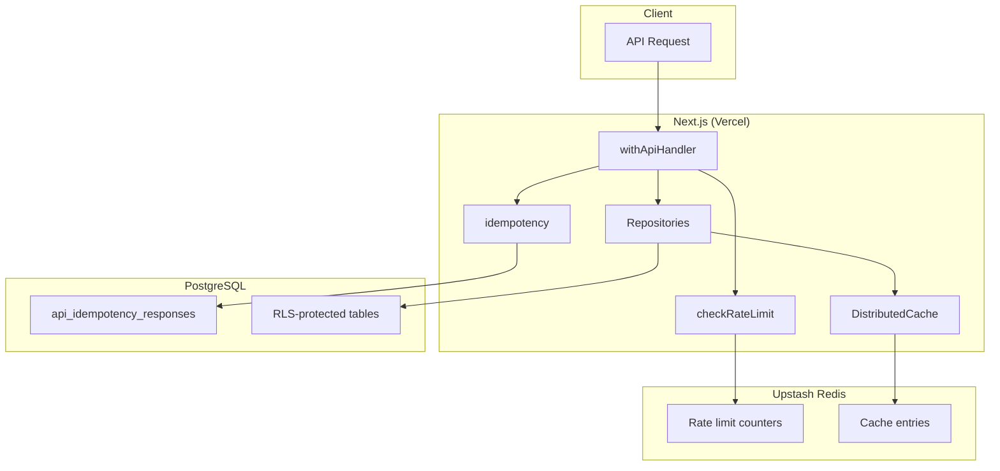

# Distributed State Architecture

Talent OS uses **Upstash Redis** for distributed rate limiting and repository caching, and **PostgreSQL** for durable API idempotency. In-memory fallbacks apply in development and CI when Redis is not configured.

## Architecture Diagram

## Components

| Component | Storage | Module | Production |
|-----------|---------|--------|:----------:|
| API rate limits | Redis (Upstash Ratelimit) | `modules/core/api/rate-limit.ts` | Required |
| AI gateway rate limits | Redis (shared) | `lib/ai/middleware/rate-limit.ts` | Required |
| API idempotency | PostgreSQL | `modules/core/api/idempotency.ts` | Required |
| Repository cache | Redis | `lib/redis/distributed-cache.ts` | Required |
| Webhook idempotency | PostgreSQL (existing) | `webhook_deliveries` | Required |

## Environment Variables

| Variable | Purpose |
|----------|---------|
| `UPSTASH_REDIS_REST_URL` | Upstash Redis REST endpoint |
| `UPSTASH_REDIS_REST_TOKEN` | Upstash authentication token |
| `IDEMPOTENCY_STORE=memory` | Force in-memory idempotency (CI/tests only) |

Production validates Redis via `assertProductionSecrets()` in `lib/env.ts`.

## Fallback Behavior

When `UPSTASH_REDIS_*` is unset (local dev, unit tests):

- Rate limits use in-memory sliding window (`lib/redis/memory-store.ts`)
- Cache uses in-memory store
- Idempotency uses memory when `IDEMPOTENCY_STORE=memory` or Supabase admin unavailable

**Production must not rely on fallbacks.**

## Migrations

| Migration | Purpose |
|-----------|---------|
| `020_enterprise_hardening.sql` | Secure RPCs, view revokes |
| `021_api_idempotency.sql` | `api_idempotency_responses` table |

## Key Prefixes (Redis)

| Prefix | Purpose |
|--------|---------|
| `rl:{category}:` | Rate limit buckets (Upstash Ratelimit) |
| `cache:` | Repository cache entries |
| `idem:` | In-memory idempotency fallback only |

## Related Documentation

- [API Standardization](./API_STANDARDIZATION.md)
- [SECURITY.md](../../SECURITY.md)
- [Observability Architecture](./OBSERVABILITY_ARCHITECTURE.md)
