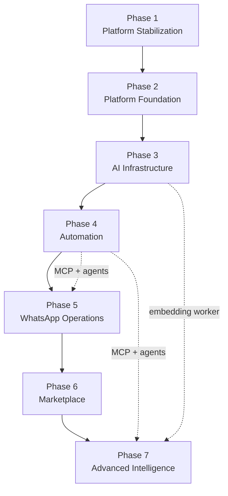

# Engineering Roadmap

| Field | Value |
|-------|-------|
| **Version** | 1.0.0 |
| **Date** | 2026-07-30 |
| **Status** | Draft — Awaiting Approval |
| **Owner** | Chief Software Architect |
| **Sources** | [Platform Blueprint](./README.md) · [Architecture Gap Analysis](./Architecture%20Gap%20Analysis.md) · [FINAL Audit](../FINAL_AUDIT.md) |
| **Rule** | No phase starts until prior phase acceptance criteria are met |

---

## How to Read This Document

This roadmap translates the [Platform Blueprint](./README.md) and [Architecture Gap Analysis](./Architecture%20Gap%20Analysis.md) into **seven sequential engineering phases**. Each phase is shippable, reviewable, and backwards-compatible unless explicitly noted.

### Effort Scale

| Symbol | Meaning | Typical scope |
|--------|---------|---------------|
| **S** | Small | 1–3 engineer-days |
| **M** | Medium | 1–2 engineer-weeks |
| **L** | Large | 2–4 engineer-weeks |
| **XL** | Extra large | 4–8 engineer-weeks |

**Phase effort** = sum of task efforts assuming one senior engineer familiar with the codebase. Parallel workstreams can reduce calendar time but increase coordination overhead.

### Gap ID Reference

Tasks reference gap IDs from [Architecture Gap Analysis](./Architecture%20Gap%20Analysis.md) (e.g. `CORE-01`, `MCP-01`).

---

## Roadmap Overview

| Phase | Name | Primary outcome | Est. effort |
|-------|------|-----------------|-------------|
| **1** | Platform Stabilization | Production-safe; zero critical audit findings | **3–4 engineer-weeks** |
| **2** | Platform Foundation | Complete domains; reliable data layer; 30% tests | **8–12 engineer-weeks** |
| **3** | AI Infrastructure | Governed, unified AI + embedding pipeline | **6–10 engineer-weeks** |
| **4** | Automation | Workflow reliability + MCP adapters + agent runtime | **10–14 engineer-weeks** |
| **5** | WhatsApp Operations | WhatsApp-first freelancer ops at production quality | **4–6 engineer-weeks** |
| **6** | Marketplace | Opt-in marketplace layer (Phase 1–3 of blueprint) | **12–18 engineer-weeks** |
| **7** | Advanced Intelligence | RAG, recommendations, partner API, intelligence moat | **14–20 engineer-weeks** |

**Total estimated effort:** ~57–84 engineer-weeks (sequential). Overlapping streams (e.g. Phase 3 embeddings while Phase 4 MCP) can compress delivery with explicit dependency management.

---

## Phase 1 — Platform Stabilization

### Objectives

1. Eliminate all **critical** security and reliability blockers identified in the [FINAL Audit](../FINAL_AUDIT.md).
2. Restore **production automation** (cron, internal routes, health checks).
3. Establish **fail-closed** security defaults for webhooks and approvals.
4. Prevent **duplicate AI execution** and data corruption from race conditions.
5. Create a **verification baseline** (smoke tests) so regressions are caught in CI.

### Deliverables

| # | Deliverable | Gap IDs |
|---|-------------|---------|
| 1.1 | `SYSTEM_ROUTES` middleware bypass (`/api/cron`, `/api/internal`, `/api/health`) | CORE-01 |
| 1.2 | Migration: `auth.uid()` guards on `create_tenant_with_admin`, `link_freelancer_to_user` | CORE-02, CORE-03 |
| 1.3 | Approval fail-closed + tenant membership check | PRJ-01, PRJ-02, WF-04 |
| 1.4 | Production webhook fail-closed (n8n + WhatsApp) | INT-01 |
| 1.5 | Atomic `claimAiRequest()` (pending → processing) | AI-01 |
| 1.6 | Cron roundtrip smoke tests in CI | CORE-04, WF-07 |
| 1.7 | Separate `CRON_SECRET` / `INTERNAL_API_SECRET` env vars | CORE-06 |
| 1.8 | Updated runbooks in operations guide | — |

### Technical Tasks

| Task | Description | Effort | Owner domain |
|------|-------------|--------|--------------|
| T1.1 | Add `SYSTEM_ROUTES` constant; evaluate before auth redirect in `middleware.ts` | S | Core |
| T1.2 | SQL migration: RPC guards + optional `REVOKE`/`GRANT` tightening | S | Database |
| T1.3 | `WorkflowEngine.resolveApproval()`: reject null approver; role fallback | S | Workflow |
| T1.4 | `app/actions/approvals.ts`: verify `approval.tenant_id` matches session | S | Projects |
| T1.5 | Webhook routes: require secrets when `NODE_ENV=production` | S | Integrations |
| T1.6 | `AiRequestRepository.claim()` with conditional update; update all executors | M | AI |
| T1.7 | Vitest: middleware route matrix; mock cron auth | M | Testing |
| T1.8 | Vitest: approval authorization regression tests | S | Testing |
| T1.9 | Deploy checklist update; verify cron in staging/production | S | DevOps |
| T1.10 | Document secret rotation procedure | S | Security |

### Risks

| Risk | Likelihood | Mitigation |
|------|------------|------------|
| RPC migration breaks signup/onboarding | Medium | Test `signUpAgency` + invite flows; staged rollout |
| Cron bypass exposes routes if misconfigured | Low | Secondary bearer auth in handlers; integration tests |
| Atomic AI claim breaks n8n retry semantics | Medium | Return 409 on already-processing; idempotent completed skip |
| Production webhook fail-closed breaks dev envs | Medium | Explicit `NODE_ENV` guard; document local `.env` requirements |

### Dependencies

| Dependency | Type |
|------------|------|
| Platform Blueprint approval | Governance |
| Staging Supabase project | Infrastructure |
| Vercel cron enabled on staging | Infrastructure |
| `ENCRYPTION_KEY` not required in Phase 1 | — |

**Blocks:** All subsequent phases.

### Acceptance Criteria

- [ ] `/api/cron/dispatch-events` returns 200 with valid bearer in staging (not 302 to `/login`)
- [ ] `/api/health` reachable without session cookie
- [ ] Pen test of RPC: authenticated user **cannot** call `create_tenant_with_admin` with another user's ID
- [ ] Pen test: authenticated user **cannot** link arbitrary freelancer to self
- [ ] Approval with null `approver_id` returns `{ ok: false, error: '...' }`
- [ ] Approval from wrong tenant returns forbidden
- [ ] Production build rejects unsigned webhook when secret configured
- [ ] Concurrent AI execute calls: exactly one processes; second skips or waits
- [ ] CI includes cron smoke test; all 79+ tests pass
- [ ] [FINAL Audit](../FINAL_AUDIT.md) critical findings (C-01 through C-05) marked resolved

### Estimated Effort

**3–4 engineer-weeks** (1 senior engineer, sequential)

---

## Phase 2 — Platform Foundation

### Objectives

1. Complete **incomplete business domains** (Finance) to match [03 Business Domains](./03%20Business%20Domains.md).
2. Resolve **architectural fragmentation** (Talent domain, query layer).
3. Harden **data layer**: indexes, encryption, RPC membership checks, archival.
4. Raise **test coverage to ≥30%** on services and workflow paths.
5. Align **event emission** with blueprint (reduce hidden DB-trigger-only paths where practical).

### Deliverables

| # | Deliverable | Gap IDs |
|---|-------------|---------|
| 2.1 | `FinanceService` approve/markPaid + server actions + UI hooks | FIN-01, FIN-02, FIN-03 |
| 2.2 | Talent domain consolidation (single factory, PortfolioService registered) | TAL-01, TAL-02 |
| 2.3 | Outbox index fix + atomic event claim | WF-01, WF-05 |
| 2.4 | Encrypt `integration_configs` secrets at rest | INT-02 |
| 2.5 | WhatsApp `phone_number_id` indexed lookup | INT-03, WA-04 |
| 2.6 | `webhook_deliveries` 72h purge cron | INT-04 |
| 2.7 | SECURITY DEFINER search RPC membership checks | TAL-03, KB-04 |
| 2.8 | Stable broadcast idempotency key | ASG-01 |
| 2.9 | Service tests: CRM, Projects, Assignment, Finance, Talent | X-03 |
| 2.10 | RLS integration test harness (foundation) | CORE-05 |
| 2.11 | Move `opportunity.opened` emit to CRMService (optional if DB trigger kept, document ADR) | CRM-01, X-04 |
| 2.12 | Trim or stub Analytics MCP catalog to match implementation | ANA-01 (partial) |

### Technical Tasks

| Task | Description | Effort |
|------|-------------|--------|
| T2.1 | Implement `FinanceService.approvePayment`, `markPaid`; emit events from service | L |
| T2.2 | Create `app/actions/payments.ts`; wire payments page actions | M |
| T2.3 | Merge `lib/domains/talent/` into canonical path; register PortfolioService in factory | L |
| T2.4 | Deprecate `lib/talent/queries.ts`; redirect imports to `lib/queries/talent.queries.ts` | M |
| T2.5 | Migration: composite index on `domain_events(status, scheduled_at)` | S |
| T2.6 | `DomainEventRepository.claimForDispatch()` with optimistic lock or RPC | M |
| T2.7 | Wrap `integration_configs.config` with `encryptJson()` on write / decrypt on read | M |
| T2.8 | Migration: expression index or column for WhatsApp `phone_number_id` | M |
| T2.9 | Cron: purge `webhook_deliveries` older than 72h | S |
| T2.10 | SQL: add `is_member_of(p_tenant_id)` to search RPCs | S |
| T2.11 | Fix broadcast idempotency key in AssignmentService | S |
| T2.12 | Vitest: FinanceService, TalentService, CRMService, ProjectService suites | L |
| T2.13 | Vitest: repository tests for invoice, workflow claim | M |
| T2.14 | Supabase local + RLS test fixture (admin, manager, freelancer, client) | L |
| T2.15 | ADR: payment event source (service vs trigger) — update TD if needed | S |

### Risks

| Risk | Likelihood | Mitigation |
|------|------------|------------|
| Talent merge breaks portfolio pages | Medium | Feature flag; comprehensive import audit |
| Finance write path conflicts with DB triggers | Medium | ADR + disable redundant trigger or make idempotent |
| Encryption migration for existing plaintext configs | High | Backfill script; dual-read during transition |
| 30% coverage target delays phase exit | Medium | Prioritize highest-risk services first |

### Dependencies

| Dependency | Required from |
|------------|---------------|
| Phase 1 complete | All acceptance criteria met |
| `ENCRYPTION_KEY` in all environments | DevOps |
| Finance UX product sign-off on approve/pay flow | Product |

**Blocks:** Phase 3 (AI infra builds on stable services), Phase 4 (workflow claim patterns).

### Acceptance Criteria

- [ ] Manager can approve and mark paid via UI; freelancer sees updated status
- [ ] `payment.approved` / `payment.paid` events emitted (service or documented trigger)
- [ ] Single import path for talent queries; PortfolioService via `createServices()`
- [ ] No references to deprecated `lib/talent/queries.ts` in app code
- [ ] Event claim prevents duplicate dispatch under parallel cron simulation
- [ ] Integration configs encrypted in DB; roundtrip read/write verified
- [ ] WhatsApp tenant resolution uses indexed lookup (< 50ms on 1000 configs)
- [ ] Line coverage ≥ 30% on `lib/services/` and `lib/workflows/`
- [ ] RLS tests pass for manager/freelancer/client isolation on 5 core tables
- [ ] Gap analysis re-run: Finance maturity ≥ 3, Talent architecture ≥ 4

### Estimated Effort

**8–12 engineer-weeks**

---

## Phase 3 — AI Infrastructure

### Objectives

1. Achieve **100% AI gateway coverage** — no bypass paths ([07 AI Platform](./07%20AI%20Platform.md), TD-005).
2. **Unify AI execution** to a single observable path via workflow engine.
3. Build **embedding pipeline** for Knowledge Platform ([10 Knowledge Platform](./10%20Knowledge%20Platform.md)).
4. Implement **distributed rate limiting** and **persisted cost tracking**.
5. Prepare provider abstraction for multi-model and fallback at scale.

### Deliverables

| # | Deliverable | Gap IDs |
|---|-------------|---------|
| 3.1 | Remove `digest` governance bypass; all features use `assertFeatureEnabled` | AI-02, WA-02 |
| 3.2 | Register WhatsApp agent prompt in PromptManager | AI-03, WA-01 |
| 3.3 | Deprecate `AI_EXECUTION_MODE=direct` and n8n-only AI path; workflow-only execution | AI-04 |
| 3.4 | Distributed rate limiter (Upstash Redis or equivalent) | AI-05, SC-03 |
| 3.5 | Persist AI cost/token usage to DB per tenant | AI-06 |
| 3.6 | Embedding worker: chunk → gateway → `storeEmbeddingVector()` | KB-01, AI-08 |
| 3.7 | Events: `knowledge.embedding_requested`, `knowledge.embedding_completed` | KB-06 |
| 3.8 | Remove legacy `openai-client.ts` direct path | AI-07 |
| 3.9 | AI gateway unit + integration tests | AI-09 |
| 3.10 | Lint rule or CI check: no direct provider imports outside `lib/ai/providers/` | — |

### Technical Tasks

| Task | Description | Effort |
|------|-------------|--------|
| T3.1 | Remove `digest` early return in `lib/ai/features/flags.ts` | S |
| T3.2 | Add `whatsapp.agent` prompt to PromptManager; migrate `runAgentQuery` | S |
| T3.3 | Route all AI dispatch through workflow `execute_ai`; remove legacy cron direct path | M |
| T3.4 | Integrate Upstash Redis rate limiter in `lib/ai/middleware/rate-limit.ts` | M |
| T3.5 | Migration: `ai_usage_daily` aggregate table or extend `ai_requests` analytics view | M |
| T3.6 | `KnowledgeEmbeddingWorker`: poll pending chunks, call gateway embed API | L |
| T3.7 | Workflow/cron job for embedding batch processing | M |
| T3.8 | Enable `search_knowledge_vector()` in KnowledgeService with integration tests | M |
| T3.9 | Emit knowledge embedding events; register in Event Catalog | S |
| T3.10 | Delete or wrap legacy OpenAI client; update status-assessment | S |
| T3.11 | Vitest: gateway governance, claim integration, embedding worker mock | L |
| T3.12 | ESLint rule: ban `@/lib/integrations/ai/openai` imports outside allowed paths | S |

### Risks

| Risk | Likelihood | Mitigation |
|------|------------|------------|
| Unified AI path breaks n8n production workflows | High | Parallel run period; feature flag `AI_EXECUTION_V2` |
| Embedding costs exceed tenant caps | Medium | Batch size limits; governance before embed |
| Redis dependency adds infra complexity | Medium | Fallback to in-memory with warning in dev |
| WhatsApp agent quality regression after prompt migration | Medium | A/B test responses; keep rollback prompt version |

### Dependencies

| Dependency | Required from |
|------------|---------------|
| Phase 1 AI-01 atomic claim | Phase 1 |
| Phase 2 stable KnowledgeService | Phase 2 |
| Upstash (or Redis) account | Infrastructure |
| OpenAI embeddings API or gateway embed method | AI Platform design |

**Blocks:** Phase 7 hybrid RAG (vectors must exist); partially blocks Phase 5 (governed WA agent).

### Acceptance Criteria

- [ ] Zero code paths call LLM outside `lib/ai/gateway.ts` (CI enforced)
- [ ] `digest` feature subject to monthly caps and tenant toggles
- [ ] All AI requests traceable: gateway → `ai_requests` → workflow run
- [ ] Rate limit enforced globally across 2+ serverless instances (load test)
- [ ] Cost per tenant queryable for current month
- [ ] New knowledge entry with content → chunks → vectors within 15 minutes
- [ ] `search_knowledge_vector()` returns results for indexed entries
- [ ] AI gateway test coverage ≥ 70%
- [ ] Gap: AI Platform compliance ≥ 80% per blueprint checklist

### Estimated Effort

**6–10 engineer-weeks**

---

## Phase 4 — Automation

### Objectives

1. Make the **workflow platform production-grade** ([09 Workflow Platform](./09%20Workflow%20Platform.md)).
2. Wire **MCP domain adapters** so agents and automation can invoke business capabilities ([08 MCP Platform](./08%20MCP%20Platform.md), TD-007).
3. Implement **agent execution loop** (tool-use orchestration).
4. Enable **sequential workflow steps** and correct delivery semantics.
5. Add **observability** for outbox, jobs, dead letters.

### Deliverables

| # | Deliverable | Gap IDs |
|---|-------------|---------|
| 4.1 | Sequential workflow step execution | WF-03 |
| 4.2 | Defer event `delivered` until workflow run completes | WF-02 |
| 4.3 | Job queue atomic claim (`SKIP LOCKED` or equivalent) | WF-01 |
| 4.4 | Archival cron for `domain_events`, `workflow_jobs` | WF-08 |
| 4.5 | Dead-letter alerting (log + optional notification) | WF-07 |
| 4.6 | MCP adapter layer: `lib/mcp/adapters/` | MCP-01 |
| 4.7 | Adapters wired: knowledge, talent, projects, crm, workflow | MCP-01, KB-02, TAL-05, CRM-03, PRJ-05 |
| 4.8 | Adapters wired: finance, ai, analytics, notification, storage | FIN-04, MCP-01, ANA-01 |
| 4.9 | MCP audit logging on invoke | MCP-02 |
| 4.10 | Agent execution loop in AgentService | AGT-01, AGT-02 |
| 4.11 | Agent session workflow events | AGT-05 |
| 4.12 | Workflow engine integration tests (trigger → job → action) | WF-07 |
| 4.13 | MCP adapter test suite per server | MCP-05 |

### Technical Tasks

| Task | Description | Effort |
|------|-------------|--------|
| T4.1 | Refactor `enqueueSteps()`: enqueue step N+1 only after step N completes | L |
| T4.2 | Change `markEventDelivered` to fire on run completion (or saga coordinator) | M |
| T4.3 | `WorkflowRepository.claimJob()` with `FOR UPDATE SKIP LOCKED` RPC | M |
| T4.4 | Cron: archive delivered events / completed jobs > 30 days | M |
| T4.5 | Alert on `dead_letter` status count > threshold | S |
| T4.6 | Create adapter interface; implement knowledge adapter (first rollout) | M |
| T4.7 | Implement talent, projects, crm adapters | L |
| T4.8 | Implement workflow, finance, ai, analytics, notification, storage adapters | L |
| T4.9 | Replace MCP gateway stub with adapter dispatch | M |
| T4.10 | MCP invoke audit log table + repository | M |
| T4.11 | AgentService.run(): LLM → tool call → MCP invoke → loop until done | XL |
| T4.12 | Emit `agent.session_started/completed`, `agent.tool_invoked` events | M |
| T4.13 | Integration tests: milestone submitted → approval → notify | L |
| T4.14 | Per-adapter Vitest with mocked services | L |

### Risks

| Risk | Likelihood | Mitigation |
|------|------------|------------|
| Sequential steps break existing parallel workflows | High | Audit registry; migrate step-by-step |
| MCP adapter scope creep (96 tools) | High | Phase 4 MVP: 40 highest-priority tools |
| Agent loop runaway token cost | Medium | Max iterations cap; timeout; cost guard |
| Delivery semantic change breaks n8n assumptions | Medium | Coordinate envelope versioning with n8n flows |

### Dependencies

| Dependency | Required from |
|------------|---------------|
| Phase 1 cron + claims | Phase 1 |
| Phase 2 FinanceService (finance adapter) | Phase 2 |
| Phase 3 AI unified path (ai adapter) | Phase 3 |
| Phase 3 embedding worker (knowledge search adapter) | Phase 3 |

**Blocks:** Phase 5 (WhatsApp agent tools), Phase 7 (agent-powered intelligence).

### Acceptance Criteria

- [ ] Multi-step workflow executes steps in defined order (integration test)
- [ ] Event not marked `delivered` if workflow run fails
- [ ] Parallel cron workers do not double-process same job (stress test)
- [ ] MCP `knowledge_search`, `talent_search`, `projects_list` return real data
- [ ] Recruiter agent `prepareRun` + `run` completes tool call successfully
- [ ] MCP invoke logged with tenant, user, tool, duration
- [ ] Dead letter count visible in ops dashboard or logs
- [ ] Gap: MCP readiness ≥ 4, Workflow readiness ≥ 4, Agents maturity ≥ 3

### Estimated Effort

**10–14 engineer-weeks**

---

## Phase 5 — WhatsApp Operations

### Objectives

1. Deliver **WhatsApp-first operations** at production quality ([12 WhatsApp Platform](./12%20WhatsApp%20Platform.md)).
2. Route WhatsApp AI through **Agent Framework** with MCP tool access.
3. Achieve **comprehensive test coverage** for WhatsApp pipeline.
4. Optimize **inbound latency** and **outbound reliability**.
5. Full **command parity** for core freelancer journeys.

### Deliverables

| # | Deliverable | Gap IDs |
|---|-------------|---------|
| 5.1 | WhatsApp agent routed via AgentService (not inline gateway) | AGT-03, WA-05 |
| 5.2 | Agent tools available on WA: status, opportunities, milestone actions | WA-05 |
| 5.3 | Full test suite: parser, intents, handlers, service, webhook route | WA-03 |
| 5.4 | Remove `intents-legacy.ts` | WA-06 |
| 5.5 | Optional direct WhatsApp send for low-latency agent replies | Blueprint §Outbound |
| 5.6 | WhatsApp workflow: enhanced `wf-whatsapp-agent` with execute path | — |
| 5.7 | Conversation context TTL and cleanup | — |
| 5.8 | Freelancer onboarding flow via WhatsApp (link phone → user) | CORE-03 related |
| 5.9 | Metrics: inbound volume, intent distribution, agent usage per tenant | — |
| 5.10 | Operations runbook: Meta webhook failures, rate limits | — |

### Technical Tasks

| Task | Description | Effort |
|------|-------------|--------|
| T5.1 | Replace `runAgentQuery` inline gateway with `AgentService.run()` scoped to freelancer context | M |
| T5.2 | Configure Knowledge/PM agent tool subsets for WhatsApp session | M |
| T5.3 | Vitest: parser fixtures from Meta webhook samples | M |
| T5.4 | Vitest: intent detection matrix (commands + context) | M |
| T5.5 | Vitest: handler delegation mocks (verify service calls, no duplicate logic) | M |
| T5.6 | Integration test: webhook POST → event emit → handler result | L |
| T5.7 | Delete `intents-legacy.ts` after parity verification | S |
| T5.8 | Evaluate Meta Cloud API direct send adapter in IntegrationService | M |
| T5.9 | Cron: expire stale `whatsapp_conversations` (> 30 days inactive) | S |
| T5.10 | Document freelancer phone linking flow; secure `link_freelancer_to_user` UX | M |
| T5.11 | Add WhatsApp metrics to analytics (or structured logs) | M |

### Risks

| Risk | Likelihood | Mitigation |
|------|------------|------------|
| Agent responses exceed WhatsApp 4096 char limit | Medium | Hard cap at 320 chars in agent policy |
| Direct send bypasses n8n template compliance | Medium | Use direct only for agent replies; templates via n8n |
| Meta API rate limits under broadcast load | Medium | Queue outbound; monitor Meta tier |
| Tool access exposes manager-only data to freelancers | High | Strict tool allowlist per WA agent profile |

### Dependencies

| Dependency | Required from |
|------------|---------------|
| Phase 3 AI governance (no digest bypass) | Phase 3 |
| Phase 4 Agent execution + MCP adapters | Phase 4 |
| Phase 1 webhook fail-closed | Phase 1 |
| Phase 2 indexed tenant lookup | Phase 2 |

**Blocks:** Phase 7 WhatsApp-native intelligence features.

### Acceptance Criteria

- [ ] Freelancer `STATUS`, `YES`, `SUBMIT`, free-text agent query work end-to-end in staging
- [ ] Agent query uses PromptManager + governance caps (no `digest` bypass)
- [ ] Agent can answer project status using MCP tools (not hallucinated)
- [ ] WhatsApp module test coverage ≥ 70%
- [ ] Zero business logic duplicated in handlers vs services (static analysis or review checklist)
- [ ] p95 inbound webhook processing < 2s (excluding AI inference)
- [ ] Runbook published and validated in fire drill
- [ ] Gap: WhatsApp Platform compliance ≥ 90%

### Estimated Effort

**4–6 engineer-weeks**

---

## Phase 6 — Marketplace

### Objectives

1. Implement **marketplace platform** per [11 Marketplace Platform](./11%20Marketplace%20Platform.md) Phases 1–3.
2. Maintain **extend, don't fork** — build on `freelancers`, `opportunities`, `AssignmentService`.
3. Enforce **opt-in visibility** and **cross-tenant security** before any public discovery.
4. Register **marketplace event catalog** entries and workflows.
5. Deliver **API-first** marketplace capabilities (no full UI redesign required).

### Deliverables

| # | Deliverable | Gap IDs |
|---|-------------|---------|
| 6.1 | Apply and verify migration 018 in staging/production | MKT-02 |
| 6.2 | `MarketplaceProfileService` — publish/unpublish, slug, redacted public view | MKT-01 |
| 6.3 | Portfolio marketplace visibility flags + service methods | Blueprint §2.4 |
| 6.4 | `MarketplaceAvailabilityService` — blocks, conflict detection, RPC | Blueprint §2.2 |
| 6.5 | `MarketplaceRatingService` — public ratings, moderation, aggregates | Blueprint §2.3 |
| 6.6 | `MarketplaceInvitationService` — cross-tenant invites | Blueprint §2.6 |
| 6.7 | `MarketplaceContractService` — contract lifecycle (MVP) | Blueprint §2.5 |
| 6.8 | Marketplace events + workflow registrations | MKT-03 |
| 6.9 | Cross-tenant RLS policies and security review | MKT-04 |
| 6.10 | MCP marketplace tools (or extend talent server) | — |
| 6.11 | Integration tests: publish → invite → accept flow | — |
| 6.12 | Rename misnamed `marketplace-flow.test.ts` | MKT-05 |

### Technical Tasks

| Task | Description | Effort |
|------|-------------|--------|
| T6.1 | Apply migration 018; regenerate types | S |
| T6.2 | `lib/services/marketplace-profile.service.ts` + repository | L |
| T6.3 | Public profile API route (redacted fields per visibility tier) | M |
| T6.4 | Extend portfolio service for `is_marketplace_visible` | M |
| T6.5 | `MarketplaceAvailabilityService` + `talent_availability_blocks` CRUD | L |
| T6.6 | Wire `check_talent_availability()` RPC | S |
| T6.7 | `MarketplaceRatingService`; separate from internal ratings | L |
| T6.8 | `MarketplaceInvitationService`; distinct from team/gig invites | L |
| T6.9 | `MarketplaceContractService` MVP: create, sign, link to project | XL |
| T6.10 | Register 7 marketplace events in catalog + workflow stubs | M |
| T6.11 | RLS: cross-tenant read only for `marketplace_visibility = marketplace` | L |
| T6.12 | Security review + penetration test on cross-tenant paths | L |
| T6.13 | Vitest + integration tests for profile publish and invitation | L |
| T6.14 | Update Platform docs and generated catalogs | S |

### Risks

| Risk | Likelihood | Mitigation |
|------|------------|------------|
| Cross-tenant data leak | High | RLS tests mandatory; external security review |
| Scope explosion (8 subdomains) | High | Strict phase gates; contract MVP only |
| Legal/compliance for marketplace | Medium | Product/legal review before public launch |
| Schema drift from blueprint | Medium | Migration 018 as source of truth; diff check |

### Dependencies

| Dependency | Required from |
|------------|---------------|
| Phases 1–4 complete (stable platform) | Prior phases |
| Phase 2 RLS test harness | Phase 2 |
| Phase 4 MCP adapters (optional marketplace tools) | Phase 4 |
| Product: visibility tiers and consent flows | Product |
| Legal: cross-tenant data policy | Legal |

**Blocks:** Phase 7 cross-tenant recommendations.

### Acceptance Criteria

- [ ] Freelancer can publish profile to `marketplace` tier with manager approval
- [ ] Public slug returns redacted profile; no internal notes or unauthorized PII
- [ ] Cross-tenant tenant A **cannot** read tenant B private roster via any API
- [ ] Availability blocks prevent double-booking in integration test
- [ ] Marketplace invitation sent, accepted, creates linked opportunity or project
- [ ] All 7 marketplace events emit and appear in `domain_events`
- [ ] Security review sign-off documented
- [ ] Gap: Marketplace readiness ≥ 3 (profile + availability + invitations)

### Estimated Effort

**12–18 engineer-weeks**

---

## Phase 7 — Advanced Intelligence

### Objectives

1. Deliver **advanced AI capabilities** that compound platform moat ([01 Vision](./01%20Vision.md) Phase D).
2. **Hybrid RAG** — FTS + vector retrieval for agents and executives.
3. **Cross-tenant recommendations** (marketplace-aware, governed).
4. Complete **analytics platform** for executive and finance agents.
5. Lay **open platform** foundation: versioned API, partner webhooks.
6. Target **60%+ test coverage** on platform modules.

### Deliverables

| # | Deliverable | Gap IDs |
|---|-------------|---------|
| 7.1 | Hybrid retrieval: FTS pre-filter + vector rerank | KB-05 |
| 7.2 | RAG pipeline for Knowledge Agent and Executive Agent | Blueprint §RAG |
| 7.3 | `MarketplaceRecommendationService` — AI + rule-based suggestions | Blueprint §2.8 |
| 7.4 | Cross-tenant matching with governance and audit | MKT + AI |
| 7.5 | Full Analytics service: fill rate, utilization, aging, AI usage | ANA-01, ANA-02 |
| 7.6 | Executive Agent: pipeline health narratives | — |
| 7.7 | Auto-capture: meeting notes → knowledge (webhook or integration) | Vision Phase D |
| 7.8 | Public API v1: `/api/v1/*` for partners | Blueprint Phase 4 |
| 7.9 | Tenant webhook subscriptions for domain events | Blueprint Phase 4 |
| 7.10 | MCP HTTP/SSE transport (optional) | MCP-04 |
| 7.11 | Distributed tracing: correlation ID end-to-end | — |
| 7.12 | Test coverage ≥ 60% platform-wide | X-03 |
| 7.13 | SOC 2 readiness assessment | Blueprint §Compliance |

### Technical Tasks

| Task | Description | Effort |
|------|-------------|--------|
| T7.1 | `KnowledgeService.searchHybrid()` — FTS top-k → vector rerank | L |
| T7.2 | Grounding pipeline: inject chunks into agent context with citations | L |
| T7.3 | `MarketplaceRecommendationService`; batch + event-driven | XL |
| T7.4 | Governed cross-tenant match: explicit buyer verification, audit log | L |
| T7.5 | SQL views: fill rate, utilization, payment aging, AI usage/month | L |
| T7.6 | Implement remaining analytics MCP tools or align catalog | M |
| T7.7 | Executive agent: scheduled workflow for pipeline summary | M |
| T7.8 | n8n or API integration for auto knowledge capture | M |
| T7.9 | API v1 router: auth (API keys/OAuth), versioning, OpenAPI spec | XL |
| T7.10 | Webhook subscription table + delivery worker for tenant events | L |
| T7.11 | Evaluate MCP SSE server for external clients | L |
| T7.12 | OpenTelemetry or structured correlation across cron → workflow → n8n | M |
| T7.13 | Expand test suites; CI coverage gate at 60% for services/workflows/ai | L |
| T7.14 | SOC 2 gap assessment document | M |

### Risks

| Risk | Likelihood | Mitigation |
|------|------------|------------|
| RAG hallucination with client-facing data | High | Citation required; manager review for external outputs |
| Cross-tenant AI leak | High | Hard tenant boundaries in retrieval; red team |
| Public API scope creep | High | MVP: read-only partner endpoints first |
| SOC 2 cost/timeline underestimated | Medium | Assessment only in Phase 7; certification later |

### Dependencies

| Dependency | Required from |
|------------|---------------|
| Phase 3 embedding pipeline operational | Phase 3 |
| Phase 4 MCP + agent runtime | Phase 4 |
| Phase 6 marketplace profiles + security | Phase 6 |
| Phase 5 WhatsApp agent (optional for capture) | Phase 5 |

**Blocks:** None (final phase).

### Acceptance Criteria

- [ ] Knowledge Agent answers entity question with cited chunks (accuracy spot-check ≥ 85%)
- [ ] Hybrid search outperforms FTS-only on benchmark query set (documented)
- [ ] Marketplace recommendations generated for verified buyer tenant
- [ ] Analytics dashboard shows fill rate, utilization, payment aging, AI usage
- [ ] API v1 documented; partner can authenticate and read tenant-scoped resources
- [ ] Tenant can subscribe to `milestone.approved` webhook with HMAC verification
- [ ] Correlation ID traceable from UI action → event → workflow → n8n in logs
- [ ] Line coverage ≥ 60% on platform-critical paths
- [ ] Gap analysis overall maturity ≥ 4.0 average across dimensions
- [ ] Blueprint Vision Phase D criteria measurably improved (document KPI delta)

### Estimated Effort

**14–20 engineer-weeks**

---

## Cross-Phase Workstreams

These run continuously across all phases:

| Workstream | Activities | Owner |
|------------|------------|-------|
| **Documentation** | Update Platform docs, ADRs, Event Catalog, runbooks after each deliverable | Engineering |
| **CI/CD** | Maintain typecheck, lint, test, docs:check; add coverage gates per phase | DevOps |
| **Security** | Review each phase; external pen test before Phase 6 marketplace | Security |
| **Observability** | Structured logging, dead-letter monitoring, cost dashboards | Platform |
| **Gap analysis refresh** | Re-run [Architecture Gap Analysis](./Architecture%20Gap%20Analysis.md) at each phase exit | Architect |

---

## Phase Exit Governance

| Gate | Requirement |
|------|-------------|
| **Code review** | All PRs; focused diffs per [15 Engineering Standards](./15%20Engineering%20Standards.md) |
| **CI green** | typecheck, lint, tests, docs:check |
| **Documentation** | Relevant Platform doc updated; migration notes if schema changed |
| **Backwards compatibility** | No breaking changes without ADR + migration path |
| **Sign-off** | Architect approval on acceptance criteria checklist |

---

## Mapping to Blueprint Roadmap (Doc 19)

| Engineering Roadmap | Blueprint Doc 19 |
|--------------------|------------------|
| Phase 1 Stabilization | Phase 0 Production Blockers |
| Phase 2 Foundation | Phase 1 Platform Hardening |
| Phase 3 AI Infrastructure | Phase 2 (partial — AI/embeddings) |
| Phase 4 Automation | Phase 2 (partial — MCP/agents) + workflow |
| Phase 5 WhatsApp | Cross-cutting (WhatsApp hardening) |
| Phase 6 Marketplace | Phase 3 Marketplace |
| Phase 7 Advanced Intelligence | Phase 4 Open Platform + intelligence |

Doc 19 remains a summary; **this document is the authoritative engineering plan**.

---

## Summary: Effort by Phase

| Phase | Name | Effort (engineer-weeks) | Cumulative |
|-------|------|-------------------------|------------|
| 1 | Platform Stabilization | 3–4 | 3–4 |
| 2 | Platform Foundation | 8–12 | 11–16 |
| 3 | AI Infrastructure | 6–10 | 17–26 |
| 4 | Automation | 10–14 | 27–40 |
| 5 | WhatsApp Operations | 4–6 | 31–46 |
| 6 | Marketplace | 12–18 | 43–64 |
| 7 | Advanced Intelligence | 14–20 | 57–84 |

---

## Cross-References

| Document | Relationship |
|----------|--------------|
| [Platform Blueprint Index](./README.md) | Target architecture |
| [Architecture Gap Analysis](./Architecture%20Gap%20Analysis.md) | Gap IDs and module scores |
| [19 Roadmap](./19%20Roadmap.md) | Executive summary roadmap |
| [FINAL Audit](../FINAL_AUDIT.md) | Phase 1 source findings |
| [15 Engineering Standards](./15%20Engineering%20Standards.md) | Implementation rules |

---

*Awaiting approval. No code changes until Phase 1 is explicitly authorized.*
