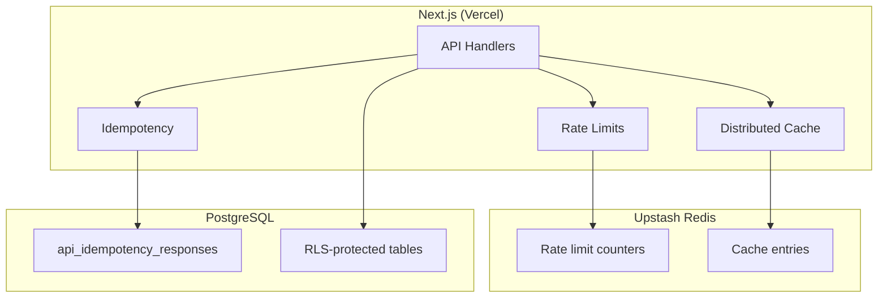

# Talent OS — Production Readiness Report

**Document version:** 3.0.0  
**Assessment date:** July 31, 2026  
**Branch:** `cursor/p0-production-blockers-5fb1`  
**Assessor:** Lead Platform Engineering

---

## Executive Summary

This report assesses Talent OS readiness after eliminating all **P0 production blockers** identified in the post-hardening gap analysis. Work completed on branch `cursor/p0-production-blockers-5fb1` builds on enterprise hardening (PR #41) and addresses distributed state, security scanning CI, test coverage, and API documentation.

| Metric | Post-Hardening (v2) | Post-P0 (v3) | Enterprise bar |
|--------|:-------------------:|:------------:|:--------------:|
| **Overall readiness** | 6.4/10 | **7.8/10** | Partial |
| Security | 7.5/10 | **8.5/10** | Partial |
| Testing | 5.0/10 | **7.0/10** | Partial |
| Scalability | 4.5/10 | **7.0/10** | Partial |
| Deployment | 7.0/10 | **8.0/10** | Partial |
| Documentation | 7.0/10 | **8.0/10** | Partial |
| Performance | 6.5/10 | **6.5/10** | Partial |
| MCP / Agents | 2.0/10 | **2.0/10** | Fail |

**Recommendation:** **Go for production** after applying migrations 020–021, provisioning Upstash Redis, and setting production secrets per `PRODUCTION_CHECKLIST.md`. **Conditional for enterprise procurement** — MFA/SSO and MCP tool adapters remain open.

---

## P0 Blocker Resolution

| # | Blocker | Status | Evidence |
|---|---------|:------:|----------|
| 1 | In-memory rate limiting | **RESOLVED** | `modules/core/api/rate-limit.ts`, `@upstash/ratelimit` |
| 2 | In-memory idempotency | **RESOLVED** | `021_api_idempotency.sql`, `modules/core/api/idempotency.ts` |
| 3 | In-memory caching | **RESOLVED** | `lib/redis/distributed-cache.ts` |
| 4 | CodeQL | **RESOLVED** | `.github/workflows/codeql.yml` |
| 5 | Dependency scanning | **RESOLVED** | `.github/dependabot.yml`, `security.yml` npm audit |
| 6 | Secret scanning | **RESOLVED** | `.github/workflows/security.yml` (Gitleaks) |
| 7 | Trivy | **RESOLVED** | `.github/workflows/security.yml` |
| 8 | RLS integration tests | **RESOLVED** | `tests/integration/rls.test.ts` |
| 9 | E2E critical workflows | **RESOLVED** | `tests/e2e/critical-workflows.spec.ts` (10 tests) |
| 10 | OpenAPI documentation | **RESOLVED** | `docs/openapi.yaml` (24 route handlers) |

---

## Test Results (July 31, 2026)

| Suite | Result | Count |
|-------|:------:|------:|
| Unit + integration (`npm test`) | **PASS** | 38 |
| Typecheck (`npm run typecheck`) | **PASS** | — |
| Lint (`npm run lint`) | **PASS** | — |
| Production build (`npm run build`) | **PASS** | — |
| E2E (`npm run test:e2e`) | **PASS** | 10 |

### Test coverage by area

| Area | Tests | Notes |
|------|------:|-------|
| Encryption / HMAC | 5 | Timing-safe comparison |
| Env validation | 6 | Production secrets + Redis |
| Permissions / pagination | 8 | Core API utilities |
| RLS migrations & RPCs | 10 | Migration 020 policies, secure RPC usage |
| Idempotency store | 5 | Memory + Postgres contract |
| Distributed state | 4 | Rate limit + cache fallbacks |
| E2E critical paths | 10 | Health, OpenAPI, auth guards, webhooks |

---

## Architecture (Distributed State)

See [DISTRIBUTED_STATE_ARCHITECTURE.md](./DISTRIBUTED_STATE_ARCHITECTURE.md) for full details.

---

## Security Posture

### Resolved

- Distributed rate limiting (Redis) — no per-instance bypass
- Durable API idempotency (Postgres) — survives cold starts
- Distributed repository cache (Redis)
- CodeQL static analysis on push/PR
- Gitleaks secret scanning
- Trivy filesystem vulnerability scan
- Dependabot weekly dependency updates
- Production requires `UPSTASH_REDIS_REST_URL` + token

### Still open (non-P0)

| Item | Severity | Notes |
|------|:--------:|-------|
| MFA / SSO | High | Enterprise procurement blocker |
| MCP tool adapters | High | Agent tool-use non-functional |
| Penetration test | Medium | No formal audit |
| PII redaction in logs | Medium | Observability tables |
| External APM export | Low | No OpenTelemetry/Sentry |

---

## Deployment Requirements

### Migrations (in order)

1. `020_enterprise_hardening.sql` — secure RPCs, view revokes
2. `021_api_idempotency.sql` — API idempotency table

### New production environment variables

| Variable | Purpose |
|----------|---------|
| `UPSTASH_REDIS_REST_URL` | Distributed rate limits + cache |
| `UPSTASH_REDIS_REST_TOKEN` | Upstash authentication |

See `PRODUCTION_CHECKLIST.md` for the complete pre-deploy checklist.

---

## Scorecard Detail

| Dimension | Score | Rationale |
|-----------|:-----:|-----------|
| Architecture | 7.0 | Solid layered design; job queue still cron-based |
| Performance | 6.5 | Indexes + parallel cron; dashboard view subqueries remain |
| Security | 8.5 | Distributed state, scanning CI, fail-closed webhooks |
| Scalability | 7.0 | Redis eliminates per-instance state; no durable queue |
| Testing | 7.0 | 48 automated tests; no live Supabase RLS runtime tests |
| Developer Experience | 7.0 | CI, OpenAPI, distributed state docs |
| Documentation | 8.0 | OpenAPI complete, checklists, architecture diagrams |
| Deployment | 8.0 | CI + security workflows + production checklist |
| AI | 6.0 | Gateway solid; dual execution paths |
| MCP | 2.0 | Stubs only |
| WhatsApp | 6.5 | Instrumented; agent bypass remains |
| Marketplace | 0.0 | Not implemented |

---

## Remaining Work (Post-P0)

### Phase B — Enterprise baseline

1. MFA/SSO via Supabase
2. MCP tool adapters (talent, projects, CRM)
3. Live Supabase RLS isolation tests (test database)
4. Load testing baseline

### Phase C — Platform capabilities

1. Durable job queue (Inngest)
2. Observability dashboard UI
3. pgvector pipeline
4. Agent settings UI

---

## Related Documents

| Document | Purpose |
|----------|---------|
| [PRODUCTION_CHECKLIST.md](../../PRODUCTION_CHECKLIST.md) | Pre-deploy checklist |
| [RELEASE_NOTES.md](../../RELEASE_NOTES.md) | v0.2.0 release notes |
| [CRITICAL_ANALYSIS_POST_HARDENING.md](./CRITICAL_ANALYSIS_POST_HARDENING.md) | Updated gap status |
| [GAP_RESOLUTION_TRACKER.md](./GAP_RESOLUTION_TRACKER.md) | Item-by-item tracker |
| [DISTRIBUTED_STATE_ARCHITECTURE.md](./DISTRIBUTED_STATE_ARCHITECTURE.md) | Redis/Postgres architecture |
| [SECURITY.md](../../SECURITY.md) | Security policy |

---

*End of Production Readiness Report v3.0.0*
