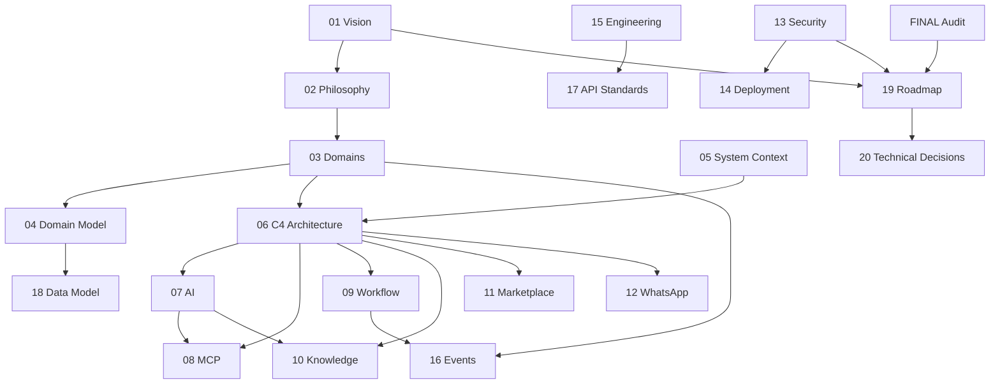

# Talent OS — Platform Blueprint

| Field | Value |
|-------|-------|
| **Version** | 1.0.0 |
| **Status** | Draft — Awaiting Approval |
| **Owner** | Chief Software Architect |
| **Last Updated** | 2026-07-30 |

---

## Purpose

This folder is the **authoritative architectural blueprint** for evolving Talent OS from MVP to a world-class AI-native Workforce Operating System. It supersedes ad-hoc design notes for strategic decisions.

**Rule:** No large implementation without a corresponding plan grounded in these documents.

---

## Document Index

| # | Document | Summary |
|---|----------|---------|
| 01 | [Vision](01%20Vision.md) | North star, strategic pillars, evolution phases |
| 02 | [Product Philosophy](02%20Product%20Philosophy.md) | Beliefs, design principles, priority stack |
| 03 | [Business Domains](03%20Business%20Domains.md) | Bounded contexts, responsibilities, layering |
| 04 | [Domain Model](04%20Domain%20Model.md) | Aggregates, entities, lifecycles |
| 05 | [System Context](05%20System%20Context.md) | C4 Level 1 — actors and external systems |
| 06 | [C4 Architecture](06%20C4%20Architecture.md) | Containers, components, request paths |
| 07 | [AI Platform](07%20AI%20Platform.md) | Gateway, governance, agents, RAG target |
| 08 | [MCP Platform](08%20MCP%20Platform.md) | Tool catalog, gateway, adapter plan |
| 09 | [Workflow Platform](09%20Workflow%20Platform.md) | Outbox, engine, approvals, reliability |
| 10 | [Knowledge Platform](10%20Knowledge%20Platform.md) | Institutional memory, FTS, vectors |
| 11 | [Marketplace Platform](11%20Marketplace%20Platform.md) | Opt-in ecosystem, eight subdomains |
| 12 | [WhatsApp Platform](12%20WhatsApp%20Platform.md) | First-class freelancer interface |
| 13 | [Security Model](13%20Security%20Model.md) | Auth, RLS, secrets, audit remediation |
| 14 | [Deployment Model](14%20Deployment%20Model.md) | Vercel, Supabase, CI/CD, scaling |
| 15 | [Engineering Standards](15%20Engineering%20Standards.md) | Layering, git, testing, docs rules |
| 16 | [Event Catalog](16%20Event%20Catalog.md) | Domain events, payloads, lifecycle |
| 17 | [API Standards](17%20API%20Standards.md) | REST, actions, MCP, versioning |
| 18 | [Data Model](18%20Data%20Model.md) | Schema, migrations, RLS, indexes |
| 19 | [Roadmap](19%20Roadmap.md) | Executive phased delivery summary |
| 20 | [Technical Decisions](20%20Technical%20Decisions.md) | ADRs and decision log |

**Detailed engineering plan:** [Engineering Roadmap](Engineering%20Roadmap.md)

### Analysis

| Document | Summary |
|----------|---------|
| [Engineering Roadmap](Engineering%20Roadmap.md) | **7-phase detailed plan** — objectives, tasks, acceptance criteria, effort |
| [Architecture Gap Analysis](Architecture%20Gap%20Analysis.md) | Repository vs blueprint — module maturity, gaps, remediation backlog |
| [FINAL Audit](../FINAL_AUDIT.md) | Point-in-time security and technical findings |

---

## Reading Order

**New to the platform:**

1. [01 Vision](01%20Vision.md) → [02 Product Philosophy](02%20Product%20Philosophy.md)
2. [05 System Context](05%20System%20Context.md) → [06 C4 Architecture](06%20C4%20Architecture.md)
3. [03 Business Domains](03%20Business%20Domains.md) → [04 Domain Model](04%20Domain%20Model.md)

**Implementing a feature:**

1. Relevant platform doc (07–12)
2. [16 Event Catalog](16%20Event%20Catalog.md)
3. [15 Engineering Standards](15%20Engineering%20Standards.md)
4. [19 Roadmap](19%20Roadmap.md) — confirm phase

**Security or production work:**

1. [FINAL Audit](../FINAL_AUDIT.md)
2. [13 Security Model](13%20Security%20Model.md)
3. [19 Roadmap](19%20Roadmap.md) Phase 0

---

## Relationship to Other Docs

| Doc Set | Role |
|---------|------|
| **`docs/Platform/`** (this folder) | Strategic architecture — **source of truth for design** |
| **`docs/*.md` guides** | Operational how-to (developer guide, deployment, etc.) |
| **`docs/generated/`** | Auto-synced catalogs from source code |
| **`docs/NN-*.md` numbered** | Legacy deep-dives — reference, migrate into Platform over time |
| **[FINAL Audit](../FINAL_AUDIT.md)** | Point-in-time findings feeding [19 Roadmap](19%20Roadmap.md) |

---

## Cross-Reference Map

---

## Approval Status

| Item | Status |
|------|--------|
| Platform Blueprint v1.0 | **Awaiting stakeholder approval** |
| Implementation | **Blocked until approval** |

Upon approval, Phase 0 ([19 Roadmap](19%20Roadmap.md)) may begin.

---

## Maintenance

Update Platform docs when:

- Architecture changes
- New domain or platform capability is added
- ADR accepted or superseded ([20 Technical Decisions](20%20Technical%20Decisions.md))
- Roadmap phase completes

Do **not** duplicate Platform content in legacy numbered docs — link here instead.
