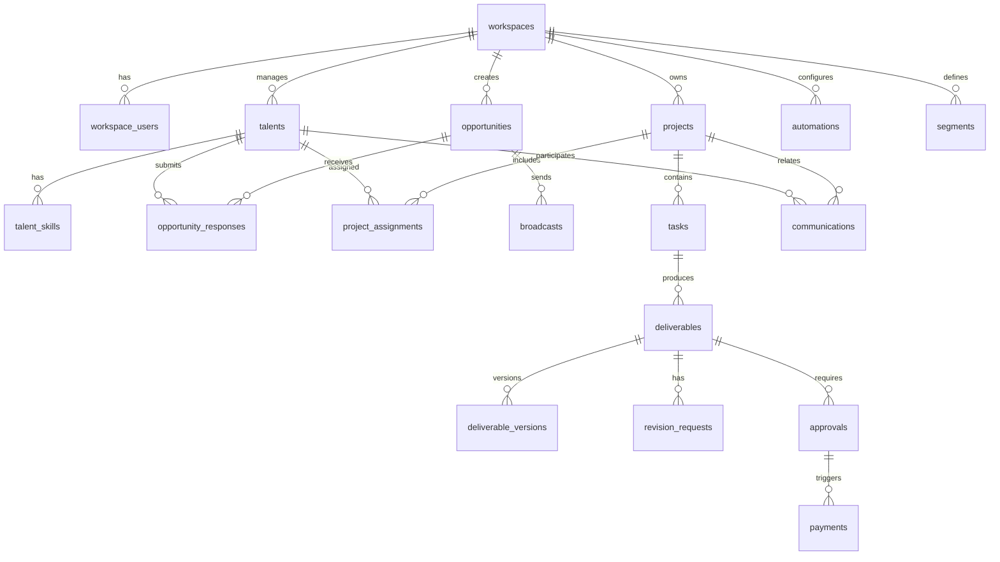

# Appendix A: TalentOS Database Design

| Field | Value |
|-------|-------|
| **Version** | 1.0.0 |
| **Engine** | PostgreSQL 16+ |
| **Pattern** | Multi-tenant shared schema |
| **Last Updated** | 2026-07-01 |

---

## 1. Design Principles

1. **Tenant isolation:** Every business table includes `workspace_id UUID NOT NULL` with composite indexes
2. **Soft delete:** `deleted_at TIMESTAMPTZ` on user-facing entities; hard delete only for GDPR erasure jobs
3. **Auditability:** Immutable `audit_logs` table; no UPDATE/DELETE grants on application role
4. **UUID primary keys:** `gen_random_uuid()` for all PKs; no sequential ID leakage
5. **Timestamps:** `created_at`, `updated_at` on all tables; UTC storage
6. **JSONB for extensibility:** Custom fields, metadata, workflow config

---

## 2. Entity Relationship Overview



---

## 3. Core Schema

### 3.1 `workspaces`

```sql
CREATE TABLE workspaces (
    id              UUID PRIMARY KEY DEFAULT gen_random_uuid(),
    name            VARCHAR(255) NOT NULL,
    slug            VARCHAR(100) NOT NULL UNIQUE,
    plan_tier       VARCHAR(50) NOT NULL DEFAULT 'starter'
                    CHECK (plan_tier IN ('starter', 'growth', 'enterprise')),
    status          VARCHAR(50) NOT NULL DEFAULT 'trial'
                    CHECK (status IN ('trial', 'active', 'past_due', 'suspended', 'cancelled', 'deleted')),
    settings        JSONB NOT NULL DEFAULT '{}',
    timezone        VARCHAR(50) NOT NULL DEFAULT 'UTC',
    currency        CHAR(3) NOT NULL DEFAULT 'USD',
    trial_ends_at   TIMESTAMPTZ,
    created_at      TIMESTAMPTZ NOT NULL DEFAULT NOW(),
    updated_at      TIMESTAMPTZ NOT NULL DEFAULT NOW(),
    deleted_at      TIMESTAMPTZ
);

CREATE INDEX idx_workspaces_status ON workspaces(status) WHERE deleted_at IS NULL;
```

**`settings` JSONB schema:**
```json
{
  "branding": { "logo_url": "", "primary_color": "#0066FF" },
  "defaults": {
    "max_revision_rounds": 3,
    "payment_approval_threshold": 1000,
    "response_grace_hours": 0
  },
  "whatsapp": {
    "phone_number_id": "",
    "business_account_id": "",
    "webhook_verify_token": ""
  },
  "integrations": {},
  "custom_fields": []
}
```

### 3.2 `users` (Global Identity)

```sql
CREATE TABLE users (
    id              UUID PRIMARY KEY DEFAULT gen_random_uuid(),
    email           VARCHAR(255) NOT NULL UNIQUE,
    password_hash   VARCHAR(255),          -- NULL if SSO-only
    full_name       VARCHAR(255) NOT NULL,
    avatar_url      TEXT,
    mfa_enabled     BOOLEAN NOT NULL DEFAULT FALSE,
    mfa_secret      VARCHAR(255),
    last_login_at   TIMESTAMPTZ,
    created_at      TIMESTAMPTZ NOT NULL DEFAULT NOW(),
    updated_at      TIMESTAMPTZ NOT NULL DEFAULT NOW(),
    deleted_at      TIMESTAMPTZ
);
```

### 3.3 `workspace_users`

```sql
CREATE TABLE workspace_users (
    id              UUID PRIMARY KEY DEFAULT gen_random_uuid(),
    workspace_id    UUID NOT NULL REFERENCES workspaces(id),
    user_id         UUID NOT NULL REFERENCES users(id),
    role            VARCHAR(50) NOT NULL,
    custom_role_id  UUID REFERENCES custom_roles(id),
    status          VARCHAR(50) NOT NULL DEFAULT 'active',
    invited_at      TIMESTAMPTZ,
    joined_at       TIMESTAMPTZ,
    created_at      TIMESTAMPTZ NOT NULL DEFAULT NOW(),
    updated_at      TIMESTAMPTZ NOT NULL DEFAULT NOW(),
    UNIQUE(workspace_id, user_id)
);

CREATE INDEX idx_workspace_users_ws ON workspace_users(workspace_id) WHERE status = 'active';
```

### 3.4 `talents`

```sql
CREATE TABLE talents (
    id                  UUID PRIMARY KEY DEFAULT gen_random_uuid(),
    workspace_id        UUID NOT NULL REFERENCES workspaces(id),
    external_id         VARCHAR(100),          -- Client reference
    full_name           VARCHAR(255) NOT NULL,
    email               VARCHAR(255),
    phone               VARCHAR(20) NOT NULL,    -- E.164 format
    phone_verified      BOOLEAN NOT NULL DEFAULT FALSE,
    whatsapp_consent    BOOLEAN NOT NULL DEFAULT FALSE,
    whatsapp_consent_at TIMESTAMPTZ,
    status              VARCHAR(50) NOT NULL DEFAULT 'pending'
                        CHECK (status IN ('pending', 'active', 'inactive', 'blocked', 'archived')),
    timezone            VARCHAR(50),
    location_country    CHAR(2),
    location_city       VARCHAR(100),
    bio                 TEXT,
    portfolio_url       TEXT,
    hourly_rate         DECIMAL(12,2),
    daily_rate          DECIMAL(12,2),
    project_rate        DECIMAL(12,2),
    rate_currency       CHAR(3) DEFAULT 'USD',
    availability_hours  DECIMAL(5,2),          -- Weekly available hours
    performance_score   DECIMAL(5,2),          -- 0-100, computed
    custom_fields       JSONB NOT NULL DEFAULT '{}',
    metadata            JSONB NOT NULL DEFAULT '{}',
    embedding_id        VARCHAR(100),          -- Vector DB reference
    created_at          TIMESTAMPTZ NOT NULL DEFAULT NOW(),
    updated_at          TIMESTAMPTZ NOT NULL DEFAULT NOW(),
    deleted_at          TIMESTAMPTZ,
    UNIQUE(workspace_id, phone)
);

CREATE INDEX idx_talents_ws_status ON talents(workspace_id, status) WHERE deleted_at IS NULL;
CREATE INDEX idx_talents_ws_score ON talents(workspace_id, performance_score DESC NULLS LAST);
CREATE INDEX idx_talents_custom ON talents USING GIN(custom_fields);
```

### 3.5 `skills` & `talent_skills`

```sql
CREATE TABLE skills (
    id              UUID PRIMARY KEY DEFAULT gen_random_uuid(),
    workspace_id    UUID NOT NULL REFERENCES workspaces(id),
    name            VARCHAR(100) NOT NULL,
    category        VARCHAR(100),
    created_at      TIMESTAMPTZ NOT NULL DEFAULT NOW(),
    UNIQUE(workspace_id, name)
);

CREATE TABLE talent_skills (
    id              UUID PRIMARY KEY DEFAULT gen_random_uuid(),
    workspace_id    UUID NOT NULL REFERENCES workspaces(id),
    talent_id       UUID NOT NULL REFERENCES talents(id),
    skill_id        UUID NOT NULL REFERENCES skills(id),
    proficiency     SMALLINT CHECK (proficiency BETWEEN 1 AND 5),
    years_experience DECIMAL(4,1),
    verified        BOOLEAN NOT NULL DEFAULT FALSE,
    created_at      TIMESTAMPTZ NOT NULL DEFAULT NOW(),
    UNIQUE(talent_id, skill_id)
);

CREATE INDEX idx_talent_skills_skill ON talent_skills(workspace_id, skill_id);
```

### 3.6 `segments`

```sql
CREATE TABLE segments (
    id              UUID PRIMARY KEY DEFAULT gen_random_uuid(),
    workspace_id    UUID NOT NULL REFERENCES workspaces(id),
    name            VARCHAR(255) NOT NULL,
    type            VARCHAR(50) NOT NULL CHECK (type IN ('static', 'dynamic')),
    filter_rules    JSONB,                     -- Dynamic segment rules
    talent_count    INTEGER NOT NULL DEFAULT 0, -- Denormalized cache
    created_at      TIMESTAMPTZ NOT NULL DEFAULT NOW(),
    updated_at      TIMESTAMPTZ NOT NULL DEFAULT NOW(),
    deleted_at      TIMESTAMPTZ
);

CREATE TABLE segment_talents (
    segment_id      UUID NOT NULL REFERENCES segments(id),
    talent_id       UUID NOT NULL REFERENCES talents(id),
    workspace_id    UUID NOT NULL REFERENCES workspaces(id),
    added_at        TIMESTAMPTZ NOT NULL DEFAULT NOW(),
    PRIMARY KEY (segment_id, talent_id)
);
```

**Dynamic segment `filter_rules` example:**
```json
{
  "operator": "AND",
  "conditions": [
    { "field": "skill", "op": "contains", "value": "video-editing" },
    { "field": "performance_score", "op": "gte", "value": 70 },
    { "field": "status", "op": "eq", "value": "active" }
  ]
}
```

### 3.7 `opportunities`

```sql
CREATE TABLE opportunities (
    id                  UUID PRIMARY KEY DEFAULT gen_random_uuid(),
    workspace_id        UUID NOT NULL REFERENCES workspaces(id),
    title               VARCHAR(500) NOT NULL,
    description         TEXT,
    requirements        JSONB NOT NULL DEFAULT '{}',
    budget_min          DECIMAL(12,2),
    budget_max          DECIMAL(12,2),
    budget_currency     CHAR(3) DEFAULT 'USD',
    response_deadline   TIMESTAMPTZ NOT NULL,
    sample_required     BOOLEAN NOT NULL DEFAULT FALSE,
    sample_brief        TEXT,
    status              VARCHAR(50) NOT NULL DEFAULT 'draft'
                        CHECK (status IN ('draft', 'scheduled', 'open', 'closed', 'filled', 'cancelled')),
    segment_id          UUID REFERENCES segments(id),
    created_by          UUID NOT NULL REFERENCES users(id),
    broadcast_at        TIMESTAMPTZ,
    closed_at           TIMESTAMPTZ,
    metadata            JSONB NOT NULL DEFAULT '{}',
    created_at          TIMESTAMPTZ NOT NULL DEFAULT NOW(),
    updated_at          TIMESTAMPTZ NOT NULL DEFAULT NOW(),
    deleted_at          TIMESTAMPTZ
);

CREATE INDEX idx_opportunities_ws_status ON opportunities(workspace_id, status);
CREATE INDEX idx_opportunities_deadline ON opportunities(workspace_id, response_deadline)
    WHERE status = 'open';
```

### 3.8 `broadcasts` & `broadcast_recipients`

```sql
CREATE TABLE broadcasts (
    id              UUID PRIMARY KEY DEFAULT gen_random_uuid(),
    workspace_id    UUID NOT NULL REFERENCES workspaces(id),
    opportunity_id  UUID NOT NULL REFERENCES opportunities(id),
    template_name   VARCHAR(255) NOT NULL,
    status          VARCHAR(50) NOT NULL DEFAULT 'pending'
                    CHECK (status IN ('pending', 'processing', 'completed', 'failed', 'cancelled')),
    scheduled_at    TIMESTAMPTZ,
    started_at      TIMESTAMPTZ,
    completed_at    TIMESTAMPTZ,
    total_count     INTEGER NOT NULL DEFAULT 0,
    sent_count      INTEGER NOT NULL DEFAULT 0,
    delivered_count INTEGER NOT NULL DEFAULT 0,
    failed_count    INTEGER NOT NULL DEFAULT 0,
    created_by      UUID NOT NULL REFERENCES users(id),
    created_at      TIMESTAMPTZ NOT NULL DEFAULT NOW()
);

CREATE TABLE broadcast_recipients (
    id              UUID PRIMARY KEY DEFAULT gen_random_uuid(),
    workspace_id    UUID NOT NULL,
    broadcast_id    UUID NOT NULL REFERENCES broadcasts(id),
    talent_id       UUID NOT NULL REFERENCES talents(id),
    whatsapp_msg_id VARCHAR(255),
    status          VARCHAR(50) NOT NULL DEFAULT 'pending'
                    CHECK (status IN ('pending', 'sent', 'delivered', 'read', 'failed')),
    error_code      VARCHAR(100),
    sent_at         TIMESTAMPTZ,
    delivered_at    TIMESTAMPTZ,
    read_at         TIMESTAMPTZ,
    created_at      TIMESTAMPTZ NOT NULL DEFAULT NOW()
);

CREATE INDEX idx_broadcast_recipients_broadcast ON broadcast_recipients(broadcast_id, status);
CREATE INDEX idx_broadcast_recipients_talent ON broadcast_recipients(workspace_id, talent_id);
```

### 3.9 `opportunity_responses`

```sql
CREATE TABLE opportunity_responses (
    id                  UUID PRIMARY KEY DEFAULT gen_random_uuid(),
    workspace_id        UUID NOT NULL REFERENCES workspaces(id),
    opportunity_id      UUID NOT NULL REFERENCES opportunities(id),
    talent_id           UUID NOT NULL REFERENCES talents(id),
    availability        TEXT,
    proposed_rate       DECIMAL(12,2),
    proposed_currency   CHAR(3),
    portfolio_link      TEXT,
    notes               TEXT,
    raw_message         TEXT,                  -- Original WhatsApp text
    parse_confidence    DECIMAL(4,3),
    ai_match_score      DECIMAL(5,2),
    shortlist_status    VARCHAR(50) NOT NULL DEFAULT 'pool'
                        CHECK (shortlist_status IN ('pool', 'shortlisted', 'rejected', 'on_hold')),
    is_late             BOOLEAN NOT NULL DEFAULT FALSE,
    responded_at        TIMESTAMPTZ NOT NULL DEFAULT NOW(),
    reviewed_by         UUID REFERENCES users(id),
    reviewed_at         TIMESTAMPTZ,
    internal_notes      TEXT,
    created_at          TIMESTAMPTZ NOT NULL DEFAULT NOW(),
    updated_at          TIMESTAMPTZ NOT NULL DEFAULT NOW(),
    UNIQUE(opportunity_id, talent_id)
);

CREATE INDEX idx_responses_opp_status ON opportunity_responses(opportunity_id, shortlist_status);
CREATE INDEX idx_responses_ai_score ON opportunity_responses(opportunity_id, ai_match_score DESC NULLS LAST);
```

### 3.10 `sample_assignments`

```sql
CREATE TABLE sample_assignments (
    id              UUID PRIMARY KEY DEFAULT gen_random_uuid(),
    workspace_id    UUID NOT NULL REFERENCES workspaces(id),
    opportunity_id  UUID NOT NULL REFERENCES opportunities(id),
    talent_id       UUID NOT NULL REFERENCES talents(id),
    brief           TEXT NOT NULL,
    compensation    DECIMAL(12,2),
    is_paid         BOOLEAN NOT NULL DEFAULT FALSE,
    deadline        TIMESTAMPTZ NOT NULL,
    status          VARCHAR(50) NOT NULL DEFAULT 'assigned'
                    CHECK (status IN ('assigned', 'submitted', 'scored', 'passed', 'failed', 'expired')),
    submission_url  TEXT,
    submitted_at    TIMESTAMPTZ,
    score           DECIMAL(5,2),
    rubric_scores   JSONB,
    scored_by       UUID REFERENCES users(id),
    scored_at       TIMESTAMPTZ,
    feedback        TEXT,
    created_at      TIMESTAMPTZ NOT NULL DEFAULT NOW(),
    updated_at      TIMESTAMPTZ NOT NULL DEFAULT NOW()
);
```

### 3.11 `projects`

```sql
CREATE TABLE projects (
    id              UUID PRIMARY KEY DEFAULT gen_random_uuid(),
    workspace_id    UUID NOT NULL REFERENCES workspaces(id),
    opportunity_id  UUID REFERENCES opportunities(id),
    name            VARCHAR(500) NOT NULL,
    description     TEXT,
    status          VARCHAR(50) NOT NULL DEFAULT 'planning'
                    CHECK (status IN ('planning', 'active', 'on_hold', 'completed', 'cancelled')),
    budget          DECIMAL(12,2),
    budget_spent    DECIMAL(12,2) NOT NULL DEFAULT 0,
    budget_currency CHAR(3) DEFAULT 'USD',
    start_date      DATE,
    end_date        DATE,
    max_revisions   SMALLINT NOT NULL DEFAULT 3,
    contract_terms  JSONB NOT NULL DEFAULT '{}',
    created_by      UUID NOT NULL REFERENCES users(id),
    project_manager UUID REFERENCES users(id),
    metadata        JSONB NOT NULL DEFAULT '{}',
    created_at      TIMESTAMPTZ NOT NULL DEFAULT NOW(),
    updated_at      TIMESTAMPTZ NOT NULL DEFAULT NOW(),
    deleted_at      TIMESTAMPTZ
);

CREATE INDEX idx_projects_ws_status ON projects(workspace_id, status) WHERE deleted_at IS NULL;
```

### 3.12 `project_assignments`

```sql
CREATE TABLE project_assignments (
    id              UUID PRIMARY KEY DEFAULT gen_random_uuid(),
    workspace_id    UUID NOT NULL REFERENCES workspaces(id),
    project_id      UUID NOT NULL REFERENCES projects(id),
    talent_id       UUID NOT NULL REFERENCES talents(id),
    role            VARCHAR(255),
    agreed_rate     DECIMAL(12,2) NOT NULL,
    rate_type       VARCHAR(50) NOT NULL CHECK (rate_type IN ('hourly', 'daily', 'fixed', 'milestone')),
    rate_currency   CHAR(3) NOT NULL DEFAULT 'USD',
    committed_hours DECIMAL(6,2),
    status          VARCHAR(50) NOT NULL DEFAULT 'pending'
                    CHECK (status IN ('pending', 'accepted', 'declined', 'active', 'completed', 'terminated')),
    accepted_at     TIMESTAMPTZ,
    completed_at    TIMESTAMPTZ,
    created_at      TIMESTAMPTZ NOT NULL DEFAULT NOW(),
    updated_at      TIMESTAMPTZ NOT NULL DEFAULT NOW(),
    UNIQUE(project_id, talent_id)
);
```

### 3.13 `tasks`

```sql
CREATE TABLE tasks (
    id              UUID PRIMARY KEY DEFAULT gen_random_uuid(),
    workspace_id    UUID NOT NULL REFERENCES workspaces(id),
    project_id      UUID NOT NULL REFERENCES projects(id),
    parent_task_id  UUID REFERENCES tasks(id),
    title           VARCHAR(500) NOT NULL,
    description     TEXT,
    assignee_talent UUID REFERENCES talents(id),
    assignee_user   UUID REFERENCES users(id),
    status          VARCHAR(50) NOT NULL DEFAULT 'todo'
                    CHECK (status IN ('todo', 'in_progress', 'blocked', 'review', 'done', 'cancelled')),
    priority        VARCHAR(20) NOT NULL DEFAULT 'medium'
                    CHECK (priority IN ('low', 'medium', 'high', 'urgent')),
    due_date        TIMESTAMPTZ,
    completed_at    TIMESTAMPTZ,
    sort_order      INTEGER NOT NULL DEFAULT 0,
    created_by      UUID NOT NULL REFERENCES users(id),
    created_at      TIMESTAMPTZ NOT NULL DEFAULT NOW(),
    updated_at      TIMESTAMPTZ NOT NULL DEFAULT NOW(),
    deleted_at      TIMESTAMPTZ
);

CREATE TABLE task_dependencies (
    task_id         UUID NOT NULL REFERENCES tasks(id),
    depends_on_id   UUID NOT NULL REFERENCES tasks(id),
    workspace_id    UUID NOT NULL,
    PRIMARY KEY (task_id, depends_on_id),
    CHECK (task_id != depends_on_id)
);

CREATE INDEX idx_tasks_project ON tasks(workspace_id, project_id, status) WHERE deleted_at IS NULL;
CREATE INDEX idx_tasks_due ON tasks(workspace_id, due_date) WHERE status NOT IN ('done', 'cancelled');
```

### 3.14 `deliverables` & `deliverable_versions`

```sql
CREATE TABLE deliverables (
    id              UUID PRIMARY KEY DEFAULT gen_random_uuid(),
    workspace_id    UUID NOT NULL REFERENCES workspaces(id),
    project_id      UUID NOT NULL REFERENCES projects(id),
    task_id         UUID NOT NULL REFERENCES tasks(id),
    talent_id       UUID NOT NULL REFERENCES talents(id),
    title           VARCHAR(500) NOT NULL,
    status          VARCHAR(50) NOT NULL DEFAULT 'pending'
                    CHECK (status IN ('pending', 'submitted', 'in_review', 'revision_requested',
                                      'approved', 'rejected')),
    current_version SMALLINT NOT NULL DEFAULT 0,
    revision_count  SMALLINT NOT NULL DEFAULT 0,
    max_revisions   SMALLINT,
    approved_at     TIMESTAMPTZ,
    approved_by     UUID REFERENCES users(id),
    created_at      TIMESTAMPTZ NOT NULL DEFAULT NOW(),
    updated_at      TIMESTAMPTZ NOT NULL DEFAULT NOW()
);

CREATE TABLE deliverable_versions (
    id              UUID PRIMARY KEY DEFAULT gen_random_uuid(),
    workspace_id    UUID NOT NULL,
    deliverable_id  UUID NOT NULL REFERENCES deliverables(id),
    version_number  SMALLINT NOT NULL,
    file_url        TEXT,
    file_key        TEXT,                      -- S3 object key
    file_size       BIGINT,
    mime_type       VARCHAR(100),
    external_link   TEXT,
    notes           TEXT,
    submitted_by    UUID NOT NULL,             -- talent_id
    submitted_at    TIMESTAMPTZ NOT NULL DEFAULT NOW(),
    UNIQUE(deliverable_id, version_number)
);
```

### 3.15 `revision_requests`

```sql
CREATE TABLE revision_requests (
    id              UUID PRIMARY KEY DEFAULT gen_random_uuid(),
    workspace_id    UUID NOT NULL,
    deliverable_id  UUID NOT NULL REFERENCES deliverables(id),
    version_id      UUID NOT NULL REFERENCES deliverable_versions(id),
    requested_by    UUID NOT NULL REFERENCES users(id),
    feedback        TEXT NOT NULL,
    rubric_feedback JSONB,
    status          VARCHAR(50) NOT NULL DEFAULT 'open'
                    CHECK (status IN ('open', 'addressed', 'cancelled')),
    due_date        TIMESTAMPTZ,
    created_at      TIMESTAMPTZ NOT NULL DEFAULT NOW(),
    resolved_at     TIMESTAMPTZ
);
```

### 3.16 `approvals`

```sql
CREATE TABLE approval_chains (
    id              UUID PRIMARY KEY DEFAULT gen_random_uuid(),
    workspace_id    UUID NOT NULL REFERENCES workspaces(id),
    name            VARCHAR(255) NOT NULL,
    steps           JSONB NOT NULL,            -- Ordered approver config
    is_default      BOOLEAN NOT NULL DEFAULT FALSE,
    created_at      TIMESTAMPTZ NOT NULL DEFAULT NOW()
);

CREATE TABLE approvals (
    id              UUID PRIMARY KEY DEFAULT gen_random_uuid(),
    workspace_id    UUID NOT NULL,
    deliverable_id  UUID NOT NULL REFERENCES deliverables(id),
    chain_id        UUID REFERENCES approval_chains(id),
    step_number     SMALLINT NOT NULL,
    approver_id     UUID NOT NULL REFERENCES users(id),
    status          VARCHAR(50) NOT NULL DEFAULT 'pending'
                    CHECK (status IN ('pending', 'approved', 'rejected', 'delegated', 'expired')),
    decision_at     TIMESTAMPTZ,
    comments        TEXT,
    delegated_to    UUID REFERENCES users(id),
    due_at          TIMESTAMPTZ,
    created_at      TIMESTAMPTZ NOT NULL DEFAULT NOW()
);

CREATE INDEX idx_approvals_pending ON approvals(workspace_id, approver_id, status)
    WHERE status = 'pending';
```

### 3.17 `payments`

```sql
CREATE TABLE payments (
    id                  UUID PRIMARY KEY DEFAULT gen_random_uuid(),
    workspace_id        UUID NOT NULL REFERENCES workspaces(id),
    deliverable_id      UUID REFERENCES deliverables(id),
    project_id          UUID NOT NULL REFERENCES projects(id),
    talent_id           UUID NOT NULL REFERENCES talents(id),
    amount              DECIMAL(12,2) NOT NULL,
    currency            CHAR(3) NOT NULL,
    status              VARCHAR(50) NOT NULL DEFAULT 'eligible'
                        CHECK (status IN ('eligible', 'pending_approval', 'approved',
                                          'processing', 'paid', 'failed', 'cancelled')),
    payment_method      VARCHAR(50),           -- stripe, wise, manual
    external_payment_id VARCHAR(255),
    approved_by         UUID REFERENCES users(id),
    approved_at         TIMESTAMPTZ,
    paid_at             TIMESTAMPTZ,
    proof_url           TEXT,
    notes               TEXT,
    idempotency_key     VARCHAR(255) UNIQUE,
    metadata            JSONB NOT NULL DEFAULT '{}',
    created_at          TIMESTAMPTZ NOT NULL DEFAULT NOW(),
    updated_at          TIMESTAMPTZ NOT NULL DEFAULT NOW()
);

CREATE INDEX idx_payments_ws_status ON payments(workspace_id, status);
CREATE INDEX idx_payments_talent ON payments(workspace_id, talent_id);
```

### 3.18 `communications`

```sql
CREATE TABLE communications (
    id              UUID PRIMARY KEY DEFAULT gen_random_uuid(),
    workspace_id    UUID NOT NULL REFERENCES workspaces(id),
    talent_id       UUID REFERENCES talents(id),
    project_id      UUID REFERENCES projects(id),
    opportunity_id  UUID REFERENCES opportunities(id),
    channel         VARCHAR(50) NOT NULL CHECK (channel IN ('whatsapp', 'email', 'web', 'phone', 'other')),
    direction       VARCHAR(20) NOT NULL CHECK (direction IN ('inbound', 'outbound')),
    message_type    VARCHAR(50),               -- template, session, manual
    content         TEXT,
    media_url       TEXT,
    whatsapp_msg_id VARCHAR(255),
    sender_type     VARCHAR(50) CHECK (sender_type IN ('talent', 'user', 'system')),
    sender_id       UUID,
    metadata        JSONB NOT NULL DEFAULT '{}',
    occurred_at     TIMESTAMPTZ NOT NULL DEFAULT NOW(),
    created_at      TIMESTAMPTZ NOT NULL DEFAULT NOW()
);

CREATE INDEX idx_comms_talent ON communications(workspace_id, talent_id, occurred_at DESC);
CREATE INDEX idx_comms_project ON communications(workspace_id, project_id, occurred_at DESC);
```

### 3.19 `performance_records`

```sql
CREATE TABLE performance_records (
    id              UUID PRIMARY KEY DEFAULT gen_random_uuid(),
    workspace_id    UUID NOT NULL REFERENCES workspaces(id),
    talent_id       UUID NOT NULL REFERENCES talents(id),
    project_id      UUID REFERENCES projects(id),
    deliverable_id  UUID REFERENCES deliverables(id),
    quality_score   DECIMAL(5,2),
    timeliness_score DECIMAL(5,2),
    revision_score  DECIMAL(5,2),
    composite_score DECIMAL(5,2) NOT NULL,
    rated_by        UUID REFERENCES users(id),
    notes           TEXT,
    recorded_at     TIMESTAMPTZ NOT NULL DEFAULT NOW()
);

CREATE INDEX idx_perf_talent ON performance_records(workspace_id, talent_id, recorded_at DESC);
```

### 3.20 `capacity_records`

```sql
CREATE TABLE capacity_records (
    id              UUID PRIMARY KEY DEFAULT gen_random_uuid(),
    workspace_id    UUID NOT NULL REFERENCES workspaces(id),
    talent_id       UUID NOT NULL REFERENCES talents(id),
    week_start      DATE NOT NULL,
    available_hours DECIMAL(5,2) NOT NULL,
    committed_hours DECIMAL(5,2) NOT NULL DEFAULT 0,
    created_at      TIMESTAMPTZ NOT NULL DEFAULT NOW(),
    updated_at      TIMESTAMPTZ NOT NULL DEFAULT NOW(),
    UNIQUE(talent_id, week_start)
);
```

### 3.21 `automations`

```sql
CREATE TABLE automations (
    id              UUID PRIMARY KEY DEFAULT gen_random_uuid(),
    workspace_id    UUID NOT NULL REFERENCES workspaces(id),
    name            VARCHAR(255) NOT NULL,
    trigger_type    VARCHAR(100) NOT NULL,
    trigger_config  JSONB NOT NULL DEFAULT '{}',
    actions         JSONB NOT NULL,            -- Array of action steps
    is_active       BOOLEAN NOT NULL DEFAULT TRUE,
    failure_count   SMALLINT NOT NULL DEFAULT 0,
    last_run_at     TIMESTAMPTZ,
    created_by      UUID NOT NULL REFERENCES users(id),
    created_at      TIMESTAMPTZ NOT NULL DEFAULT NOW(),
    updated_at      TIMESTAMPTZ NOT NULL DEFAULT NOW()
);

CREATE TABLE automation_executions (
    id              UUID PRIMARY KEY DEFAULT gen_random_uuid(),
    workspace_id    UUID NOT NULL,
    automation_id   UUID NOT NULL REFERENCES automations(id),
    trigger_event   JSONB NOT NULL,
    status          VARCHAR(50) NOT NULL CHECK (status IN ('running', 'completed', 'failed')),
    steps_log       JSONB NOT NULL DEFAULT '[]',
    started_at      TIMESTAMPTZ NOT NULL DEFAULT NOW(),
    completed_at    TIMESTAMPTZ
);
```

### 3.22 `audit_logs` (Immutable)

```sql
CREATE TABLE audit_logs (
    id              UUID PRIMARY KEY DEFAULT gen_random_uuid(),
    workspace_id    UUID NOT NULL,
    actor_type      VARCHAR(50) NOT NULL,        -- user, system, talent, api_key
    actor_id        UUID,
    action          VARCHAR(100) NOT NULL,
    entity_type     VARCHAR(100) NOT NULL,
    entity_id       UUID NOT NULL,
    old_values      JSONB,
    new_values      JSONB,
    ip_address      INET,
    user_agent      TEXT,
    request_id      UUID,
    occurred_at     TIMESTAMPTZ NOT NULL DEFAULT NOW()
) PARTITION BY RANGE (occurred_at);

-- Monthly partitions created via pg_partman
CREATE INDEX idx_audit_ws_entity ON audit_logs(workspace_id, entity_type, entity_id);
CREATE INDEX idx_audit_ws_actor ON audit_logs(workspace_id, actor_id, occurred_at DESC);

-- Revoke UPDATE/DELETE from application role
REVOKE UPDATE, DELETE ON audit_logs FROM talentos_app;
```

---

## 4. Indexing Strategy

| Query Pattern | Index |
|---------------|-------|
| Tenant-scoped list | `(workspace_id, status, created_at DESC)` |
| Talent search by skill | `talent_skills(workspace_id, skill_id)` + JOIN |
| Open opportunities | `(workspace_id, status) WHERE status = 'open'` |
| Pending approvals | `(workspace_id, approver_id, status) WHERE status = 'pending'` |
| Payment pipeline | `(workspace_id, status, created_at)` |
| Communication timeline | `(workspace_id, talent_id, occurred_at DESC)` |
| Audit lookup | `(workspace_id, entity_type, entity_id)` |

---

## 5. Row-Level Security (Enterprise Option)

```sql
ALTER TABLE talents ENABLE ROW LEVEL SECURITY;

CREATE POLICY tenant_isolation ON talents
    USING (workspace_id = current_setting('app.workspace_id')::UUID);
```

Application sets `SET app.workspace_id = '<uuid>'` per connection via middleware.

---

## 6. Migration & Versioning

- **Tool:** Flyway or Alembic
- **Naming:** `V{version}__{description}.sql`
- **Zero-downtime:** Expand-contract pattern for schema changes
- **Seed data:** System skills, default approval chains, WhatsApp templates

---

## 7. Data Retention

| Data Type | Starter | Growth | Enterprise |
|-----------|---------|--------|------------|
| Audit logs | 90 days | 1 year | 7 years |
| Communications | 1 year | 3 years | Configurable |
| Deliverable files | 1 year active | 3 years | Configurable |
| Deleted workspace | 30-day soft delete → anonymize | Same | Custom |

---

## 8. Backup & Recovery

- **Continuous WAL archiving** to S3
- **Daily full backups** with 30-day retention
- **Point-in-time recovery** to any second within retention window
- **Cross-region replica** for Enterprise DR
