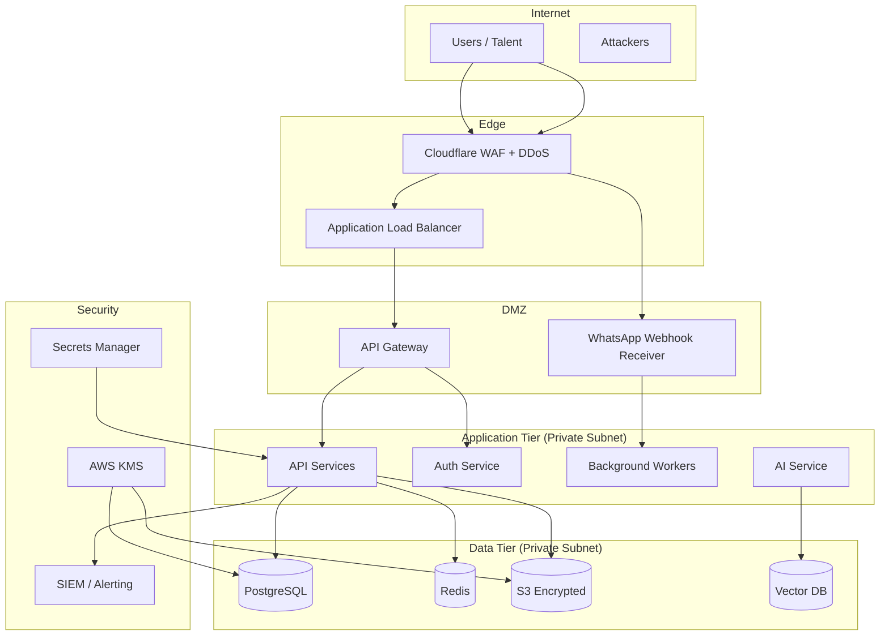
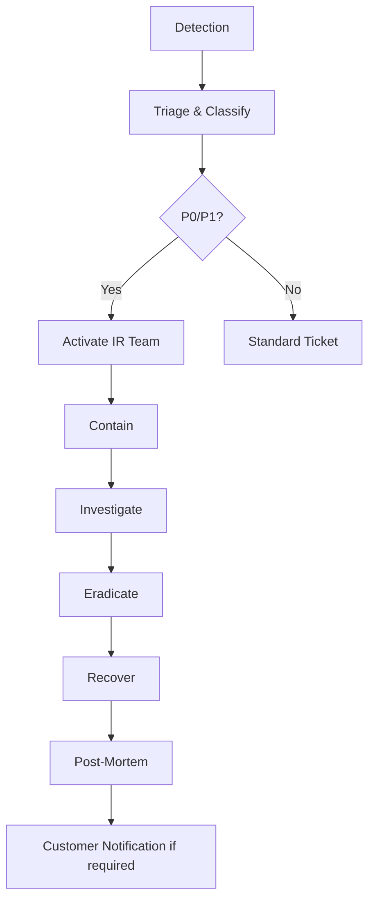
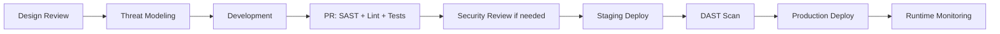

# Appendix C: TalentOS Security Architecture

| Field | Value |
|-------|-------|
| **Version** | 1.0.0 |
| **Classification** | Internal — Confidential |
| **Compliance Targets** | SOC 2 Type II, GDPR |
| **Last Updated** | 2026-07-01 |

---

## 1. Security Principles

1. **Defense in depth** — Multiple layers: network, application, data
2. **Least privilege** — Minimal permissions by default; just-in-time elevation
3. **Zero trust** — Verify every request; no implicit trust by network zone
4. **Secure by default** — MFA for admins, encryption on, audit logging enabled
5. **Privacy by design** — Data minimization, consent tracking, erasure capability

---

## 2. Security Architecture Overview



---

## 3. Authentication

### 3.1 User Authentication

| Method | Implementation | Notes |
|--------|---------------|-------|
| Email/password | Argon2id hashing | Min 12 chars; breach password check (HaveIBeenPwned) |
| MFA | TOTP (RFC 6238) | Required for Admin+; optional for Member |
| SSO | SAML 2.0 / OIDC | Enterprise; Okta, Azure AD, Google Workspace |
| Session | JWT (RS256) + refresh token rotation | Access: 1h; Refresh: 7d; family detection |
| API keys | Scoped, rotatable | Hashed at rest; prefix `tos_live_` / `tos_test_` |

### 3.2 Talent Authentication

| Method | Use Case |
|--------|----------|
| WhatsApp phone verification | Primary identity binding |
| Magic link (JWT) | Web microsite access; 24h expiry |
| No password | Talent does not create accounts |

### 3.3 Token Security

```
Access Token (JWT):
  - Algorithm: RS256
  - Issuer: auth.talentos.io
  - Claims: sub, workspace_id, role, permissions, iat, exp, jti
  - Stored: Memory only (web); HttpOnly cookie option

Refresh Token:
  - Opaque UUID
  - Stored: HttpOnly, Secure, SameSite=Strict cookie
  - Rotation on each use; reuse detection revokes family
```

---

## 4. Authorization

See [Appendix D: Permissions Architecture](./D-permissions-architecture.md) for full RBAC model.

**Enforcement layers:**
1. API Gateway — JWT validation, rate limiting
2. Middleware — `workspace_id` extraction, permission check
3. Service layer — Business rule authorization
4. Database — Row-level security (Enterprise option)

---

## 5. Data Protection

### 5.1 Encryption

| Layer | Method | Key Management |
|-------|--------|----------------|
| At rest (DB) | AES-256 (RDS encryption) | AWS KMS CMK per environment |
| At rest (S3) | SSE-KMS | Per-bucket CMK; bucket policies |
| At rest (Redis) | Encryption in transit + at rest (ElastiCache) | AWS managed |
| In transit | TLS 1.3 | ACM certificates; HSTS enabled |
| Application-level PII | Field-level encryption for SSN/tax IDs | Vault transit engine |
| Backups | Encrypted; separate KMS key | Cross-region replication encrypted |

### 5.2 PII Classification

| Classification | Examples | Handling |
|----------------|----------|----------|
| **Public** | Skill names, job titles | Standard storage |
| **Internal** | Internal notes, scores | Tenant-scoped access |
| **Confidential** | Email, phone, rates | Encrypted; audit on access |
| **Restricted** | Tax IDs, bank details | Field-level encryption; Finance role only |

### 5.3 Data Residency

| Region | Availability | Data Stored |
|--------|-------------|-------------|
| US (default) | All tiers | All data |
| EU (Frankfurt) | Enterprise | All tenant data in EU |
| APAC (Singapore) | Enterprise (Phase 4) | All tenant data in APAC |

---

## 6. Network Security

### 6.1 Network Segmentation

```
VPC (10.0.0.0/16)
├── Public Subnets (10.0.1.0/24, 10.0.2.0/24)
│   └── ALB, NAT Gateway
├── Private App Subnets (10.0.10.0/24, 10.0.11.0/24)
│   └── EKS nodes / ECS tasks
└── Private Data Subnets (10.0.20.0/24, 10.0.21.0/24)
    └── RDS, ElastiCache, no internet route
```

### 6.2 Firewall Rules

| Source | Destination | Port | Protocol | Purpose |
|--------|-------------|------|----------|---------|
| Cloudflare IPs | ALB | 443 | HTTPS | Public traffic |
| ALB | App subnets | 8080 | HTTP | Internal routing |
| App subnets | RDS | 5432 | TCP | Database |
| App subnets | Redis | 6379 | TCP | Cache |
| App subnets | S3 | 443 | HTTPS | Via VPC endpoint |
| Meta webhook IPs | WA receiver | 443 | HTTPS | WhatsApp callbacks |

### 6.3 DDoS & WAF

- Cloudflare Pro/Business for DDoS mitigation
- WAF rules: OWASP Top 10, rate limiting, geo-blocking (optional)
- Bot management for webhook endpoints

---

## 7. Application Security

### 7.1 OWASP Mitigations

| Threat | Mitigation |
|--------|------------|
| Injection | Parameterized queries (ORM); input validation (Zod/Pydantic) |
| Broken Auth | MFA, token rotation, session invalidation |
| XSS | CSP headers; React auto-escaping; DOMPurify for rich text |
| CSRF | SameSite cookies; CSRF tokens for cookie-auth |
| SSRF | Allowlist for webhook URLs; no internal IP access |
| IDOR | workspace_id enforcement on every query |
| Mass assignment | DTO validation; explicit field allowlists |

### 7.2 Security Headers

```http
Strict-Transport-Security: max-age=31536000; includeSubDomains; preload
Content-Security-Policy: default-src 'self'; script-src 'self'; frame-ancestors 'none'
X-Content-Type-Options: nosniff
X-Frame-Options: DENY
Referrer-Policy: strict-origin-when-cross-origin
Permissions-Policy: camera=(), microphone=(), geolocation=()
```

### 7.3 File Upload Security

- Presigned S3 URLs with content-type validation
- ClamAV virus scanning on upload
- Max file size: 500MB
- Blocked extensions: `.exe`, `.bat`, `.sh`, `.php`, `.js`
- MIME type verification (magic bytes)

---

## 8. WhatsApp Security

| Control | Implementation |
|---------|---------------|
| Webhook verification | Meta `hub.verify_token` + `X-Hub-Signature-256` HMAC |
| Template-only outbound | No free-form initiation outside 24h window |
| Consent tracking | `whatsapp_consent` flag; STOP keyword handler |
| Message content | No PII in template parameters beyond name |
| Rate limiting | Per-workspace throttle; circuit breaker |

---

## 9. Secrets Management

| Secret Type | Storage | Rotation |
|-------------|---------|----------|
| Database credentials | AWS Secrets Manager | 90 days auto-rotate |
| JWT signing keys | AWS KMS | Annual; dual-key rotation |
| API keys (customer) | Hashed in DB (Argon2) | Customer-initiated |
| WhatsApp tokens | Secrets Manager | On Meta rotation |
| Payment provider keys | Secrets Manager | 90 days |
| Encryption keys | AWS KMS CMK | Annual |

**Prohibited:** Secrets in code, env files in repo, or client-side storage.

---

## 10. Vulnerability Management

| Activity | Frequency | SLA |
|----------|-----------|-----|
| Dependency scanning (Snyk/Dependabot) | Continuous | Critical: 24h; High: 7d |
| SAST (CodeQL) | Every PR | Block merge on critical |
| Container scanning (Trivy) | Every build | Block deploy on critical |
| Penetration testing | Annual | Report within 30 days |
| Bug bounty | Year 2 launch | HackerOne platform |

---

## 11. Incident Response

### 11.1 Severity Classification

| Severity | Definition | Response Time |
|----------|------------|---------------|
| P0 — Critical | Active breach, data exfiltration | 15 min |
| P1 — High | Vulnerability actively exploited | 1 hour |
| P2 — Medium | Vulnerability discovered, not exploited | 24 hours |
| P3 — Low | Security improvement | Next sprint |

### 11.2 Incident Response Playbook



### 11.3 Breach Notification

- Internal notification: Immediate (P0/P1)
- Customer notification: Within 72 hours (GDPR)
- Regulatory notification: Per jurisdiction requirements
- Status page update: Within 1 hour of confirmed incident

---

## 12. Compliance

### 12.1 GDPR

| Requirement | Implementation |
|-------------|---------------|
| Lawful basis | Consent (WhatsApp opt-in); legitimate interest (contract) |
| Right to access | Data export API |
| Right to erasure | Anonymization job; 30-day completion |
| Right to portability | JSON/CSV export |
| Data Processing Agreement | Standard DPA for all customers |
| DPO | Appointed at Series A |

### 12.2 SOC 2 Type II

| Trust Principle | Key Controls |
|-----------------|-------------|
| Security | WAF, MFA, encryption, pen testing |
| Availability | 99.9% SLA, multi-AZ, DR plan |
| Processing Integrity | Idempotency, audit logs, approval workflows |
| Confidentiality | RBAC, encryption, data classification |
| Privacy | Consent management, erasure, DPA |

### 12.3 WhatsApp / Meta Compliance

- Business Solution Provider (BSP) partnership
- Template pre-approval workflow
- Opt-in/opt-out management
- Quality rating monitoring

---

## 13. Security Monitoring

| Signal | Tool | Alert |
|--------|------|-------|
| Failed login attempts | Auth service | > 10/min per IP |
| Permission denied spikes | API middleware | > 50/min per user |
| Unusual data export volume | Audit service | > 1000 records/hour |
| Webhook signature failures | WA receiver | Any failure |
| Privilege escalation attempts | RBAC engine | Any attempt |
| Geo-anomaly login | Auth service | Login from new country |

---

## 14. Secure SDLC



**Security review required for:**
- Authentication/authorization changes
- Payment processing changes
- PII handling changes
- New third-party integrations
- Infrastructure changes
