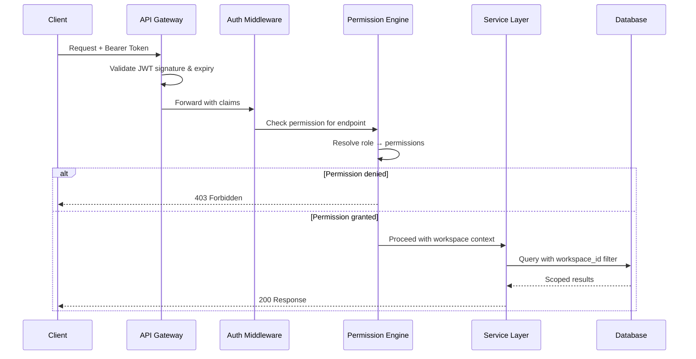

# Appendix D: TalentOS Permissions Architecture

| Field | Value |
|-------|-------|
| **Version** | 1.0.0 |
| **Model** | RBAC with atomic permissions |
| **Last Updated** | 2026-07-01 |

---

## 1. Overview

TalentOS implements Role-Based Access Control (RBAC) with:

- **47 atomic permissions** grouped by resource domain
- **9 system roles** with predefined permission sets
- **Custom roles** (Enterprise) composed from atomic permissions
- **Workspace-scoped enforcement** on every authorization check
- **Permission inheritance** via role hierarchy (Owner > Admin > specialized roles)

---

## 2. Permission Model

### 2.1 Permission Naming Convention

```
{resource}:{action}

Examples:
  talents:read
  opportunities:broadcast
  payments:approve
```

### 2.2 Atomic Permissions Registry

#### Workspace & Members

| Permission | Description |
|------------|-------------|
| `workspace:read` | View workspace settings and usage |
| `workspace:write` | Modify workspace settings |
| `workspace:billing` | Manage subscription and billing |
| `workspace:delete` | Delete workspace |
| `members:read` | View team members |
| `members:write` | Invite, remove, change roles |
| `roles:read` | View custom roles |
| `roles:write` | Create and modify custom roles |

#### Talent Management

| Permission | Description |
|------------|-------------|
| `talents:read` | View talent profiles |
| `talents:write` | Create and update talents |
| `talents:delete` | Archive/block talents |
| `talents:import` | Bulk import talents |
| `segments:read` | View segments |
| `segments:write` | Create and manage segments |
| `segments:delete` | Delete segments |
| `skills:read` | View skills taxonomy |
| `skills:write` | Manage skills |

#### Opportunity Lifecycle

| Permission | Description |
|------------|-------------|
| `opportunities:read` | View opportunities |
| `opportunities:write` | Create and edit opportunities |
| `opportunities:delete` | Cancel/delete opportunities |
| `opportunities:broadcast` | Send WhatsApp broadcasts |
| `shortlist:read` | View shortlist decisions |
| `shortlist:write` | Shortlist/reject candidates |
| `samples:read` | View sample assignments |
| `samples:write` | Create sample assignments |
| `samples:score` | Score sample submissions |

#### Project Execution

| Permission | Description |
|------------|-------------|
| `projects:read` | View projects |
| `projects:write` | Create and manage projects |
| `projects:delete` | Cancel/archive projects |
| `tasks:read` | View tasks |
| `tasks:write` | Create and manage tasks |
| `deliverables:read` | View deliverables |
| `deliverables:write` | Create deliverable records |
| `deliverables:submit` | Submit on behalf of talent |
| `deliverables:approve` | Approve/reject/request revisions |

#### Approvals & Payments

| Permission | Description |
|------------|-------------|
| `approvals:read` | View approval chains and status |
| `approvals:write` | Configure approval chains |
| `approvals:decide` | Approve/reject in workflow |
| `payments:read` | View payment records |
| `payments:approve` | Approve payments for processing |
| `payments:process` | Initiate/record payouts |
| `payments:export` | Export payment data |

#### Communications & Analytics

| Permission | Description |
|------------|-------------|
| `communications:read` | View communication logs |
| `communications:write` | Log manual communications |
| `analytics:read` | View dashboards and analytics |
| `reports:read` | Generate and export reports |
| `audit:read` | View audit logs |

#### Automations & Integrations

| Permission | Description |
|------------|-------------|
| `automations:read` | View automations |
| `automations:write` | Create and manage automations |
| `integrations:read` | View integrations |
| `integrations:write` | Configure integrations |
| `api_keys:read` | View API keys |
| `api_keys:write` | Create and revoke API keys |
| `webhooks:read` | View webhook endpoints |
| `webhooks:write` | Configure webhooks |

---

## 3. System Roles

### 3.1 Role-Permission Matrix

| Permission | Owner | Admin | Talent Mgr | Project Mgr | Creative Lead | Finance | Analyst | Member |
|------------|:-----:|:-----:|:----------:|:-----------:|:-------------:|:-------:|:-------:|:------:|
| workspace:read | ✓ | ✓ | ✓ | ✓ | ✓ | ✓ | ✓ | ✓ |
| workspace:write | ✓ | ✓ | | | | | | |
| workspace:billing | ✓ | | | | | | | |
| workspace:delete | ✓ | | | | | | | |
| members:read | ✓ | ✓ | ✓ | ✓ | ✓ | ✓ | ✓ | |
| members:write | ✓ | ✓ | | | | | | |
| talents:read | ✓ | ✓ | ✓ | ✓ | ✓ | ✓ | ✓ | ○ |
| talents:write | ✓ | ✓ | ✓ | | | | | |
| talents:delete | ✓ | ✓ | ✓ | | | | | |
| opportunities:read | ✓ | ✓ | ✓ | ✓ | ✓ | | ✓ | |
| opportunities:write | ✓ | ✓ | ✓ | | | | | |
| opportunities:broadcast | ✓ | ✓ | ✓ | | | | | |
| shortlist:write | ✓ | ✓ | ✓ | ✓ | | | | |
| samples:score | ✓ | ✓ | ✓ | | ✓ | | | |
| projects:read | ✓ | ✓ | ✓ | ✓ | ✓ | ✓ | ✓ | ○ |
| projects:write | ✓ | ✓ | | ✓ | | | | |
| tasks:write | ✓ | ✓ | | ✓ | | | | |
| deliverables:approve | ✓ | ✓ | | ✓ | ✓ | | | |
| approvals:decide | ✓ | ✓ | | ✓ | ✓ | | | |
| payments:read | ✓ | ✓ | | ✓ | | ✓ | ✓ | |
| payments:approve | ✓ | ✓ | | | | ✓ | | |
| payments:process | ✓ | ✓ | | | | ✓ | | |
| analytics:read | ✓ | ✓ | ✓ | ✓ | ✓ | ✓ | ✓ | |
| audit:read | ✓ | ✓ | | | | | | |
| automations:write | ✓ | ✓ | ✓ | ✓ | | | | |
| integrations:write | ✓ | ✓ | | | | | | |
| api_keys:write | ✓ | ✓ | | | | | | |

**Legend:** ✓ = full access | ○ = scoped (assigned projects only) | blank = no access

### 3.2 Role Descriptions

```yaml
owner:
  description: Workspace creator; full control including billing
  assignable_by: [owner]
  max_per_workspace: 2

admin:
  description: Operational administrator; all except billing/deletion
  assignable_by: [owner]

talent_manager:
  description: Manages talent database, opportunities, shortlisting
  assignable_by: [owner, admin]

project_manager:
  description: Manages projects, tasks, deliverables, assignments
  assignable_by: [owner, admin]

creative_lead:
  description: Quality gate; approves deliverables and scores samples
  assignable_by: [owner, admin]

finance_manager:
  description: Payment approval, processing, and export
  assignable_by: [owner, admin]

analyst:
  description: Read-only access to analytics and reports
  assignable_by: [owner, admin]

member:
  description: Limited view of assigned projects
  assignable_by: [owner, admin, project_manager]
```

---

## 4. Custom Roles (Enterprise)

### 4.1 Schema

```sql
CREATE TABLE custom_roles (
    id              UUID PRIMARY KEY DEFAULT gen_random_uuid(),
    workspace_id    UUID NOT NULL REFERENCES workspaces(id),
    name            VARCHAR(100) NOT NULL,
    description     TEXT,
    permissions     TEXT[] NOT NULL,           -- Array of permission strings
    created_by      UUID NOT NULL REFERENCES users(id),
    created_at      TIMESTAMPTZ NOT NULL DEFAULT NOW(),
    updated_at      TIMESTAMPTZ NOT NULL DEFAULT NOW(),
    UNIQUE(workspace_id, name)
);
```

### 4.2 Custom Role Example

```json
{
  "name": "Senior Talent Coordinator",
  "description": "Can manage talent and opportunities but not broadcast or delete",
  "permissions": [
    "talents:read", "talents:write", "talents:import",
    "segments:read", "segments:write",
    "opportunities:read", "opportunities:write",
    "shortlist:read", "shortlist:write",
    "samples:read", "samples:write",
    "analytics:read"
  ]
}
```

---

## 5. Authorization Enforcement

### 5.1 Request Flow



### 5.2 Middleware Implementation (Pseudocode)

```python
def authorize(required_permission: str):
    def decorator(handler):
        async def wrapper(request, ctx):
            user_perms = resolve_permissions(
                user_id=ctx.user_id,
                workspace_id=ctx.workspace_id,
                custom_role_id=ctx.custom_role_id
            )
            if required_permission not in user_perms:
                raise ForbiddenError(
                    f"Missing permission: {required_permission}"
                )
            return await handler(request, ctx)
        return wrapper
    return decorator
```

### 5.3 Scoped Access (Member Role)

Members with `projects:read ○` (scoped) see only projects where:

```sql
SELECT p.* FROM projects p
JOIN project_assignments pa ON pa.project_id = p.id
JOIN workspace_users wu ON wu.user_id = :current_user_id
WHERE p.workspace_id = :workspace_id
  AND (
    p.project_manager = :current_user_id
    OR pa.talent_id IN (
      SELECT talent_id FROM project_assignments
      WHERE project_id IN (
        SELECT id FROM projects WHERE created_by = :current_user_id
      )
    )
  );
```

---

## 6. API Key Scopes

API keys map to subsets of permissions:

| Scope Group | Permissions Included |
|-------------|---------------------|
| `read` | All `*:read` permissions |
| `talents` | `talents:*`, `segments:*`, `skills:*` |
| `opportunities` | `opportunities:*`, `shortlist:*`, `samples:*` |
| `projects` | `projects:*`, `tasks:*`, `deliverables:*` |
| `payments` | `payments:*` |
| `webhooks` | `webhooks:*` + event delivery |
| `admin` | All permissions (Owner/Admin only) |

```http
POST /v1/api-keys
{
  "name": "Zapier Integration",
  "scopes": ["read", "opportunities", "projects"],
  "expires_at": "2027-01-01T00:00:00Z"
}
```

---

## 7. Talent Permissions (External)

Talent (WhatsApp users) have implicit self-service permissions:

| Action | Scope |
|--------|-------|
| View own profile | Own `talent_id` only |
| Respond to opportunities | Opportunities broadcast to them |
| Submit deliverables | Own assigned tasks |
| View own payments | Own payment records |
| View own projects | Assigned projects only |

**No access to:** Other talent data, internal notes, shortlist decisions, workspace settings.

---

## 8. Permission Caching

```
Cache key: perm:{workspace_id}:{user_id}
TTL: 5 minutes
Invalidation triggers:
  - Role change
  - Custom role modification
  - User removed from workspace
  - Permission registry update (deploy)
```

---

## 9. Audit of Permission Changes

All permission-related changes logged:

```json
{
  "action": "member.role_changed",
  "entity_type": "workspace_user",
  "entity_id": "uuid",
  "old_values": { "role": "member" },
  "new_values": { "role": "talent_manager" },
  "actor_id": "admin-uuid"
}
```

---

## 10. Testing Requirements

| Test Type | Coverage |
|-----------|----------|
| Unit tests | Every permission check function |
| Integration tests | Each role × each endpoint matrix cell |
| Negative tests | Privilege escalation attempts |
| Regression | Permission changes require matrix update |

**CI gate:** Permission matrix test must pass before deploy.
