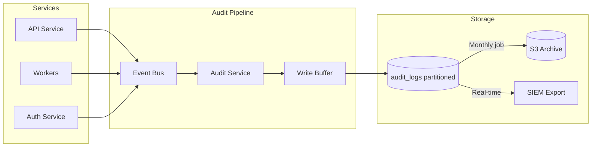

# Appendix E: TalentOS Audit Logging Design

| Field | Value |
|-------|-------|
| **Version** | 1.0.0 |
| **Storage** | PostgreSQL (partitioned) + S3 archive |
| **Immutability** | Append-only; no UPDATE/DELETE |
| **Last Updated** | 2026-07-01 |

---

## 1. Purpose

Audit logging provides:

1. **Compliance** — SOC 2, GDPR accountability
2. **Security** — Forensic investigation of incidents
3. **Operational** — Debugging workflow issues
4. **Business** — Activity tracking and accountability

---

## 2. Architecture



---

## 3. Audit Event Schema

### 3.1 Core Fields

| Field | Type | Required | Description |
|-------|------|----------|-------------|
| `id` | UUID | Yes | Unique event ID |
| `workspace_id` | UUID | Yes | Tenant scope |
| `occurred_at` | TIMESTAMPTZ | Yes | Event timestamp (UTC) |
| `actor_type` | ENUM | Yes | `user`, `talent`, `system`, `api_key`, `webhook` |
| `actor_id` | UUID | No | Actor identifier |
| `actor_email` | VARCHAR | No | Denormalized for display |
| `action` | VARCHAR | Yes | Dot-notation action (e.g., `talent.created`) |
| `entity_type` | VARCHAR | Yes | Resource type (e.g., `talent`, `payment`) |
| `entity_id` | UUID | Yes | Resource identifier |
| `old_values` | JSONB | No | Previous state (diff) |
| `new_values` | JSONB | No | New state (diff) |
| `metadata` | JSONB | No | Additional context |
| `ip_address` | INET | No | Client IP |
| `user_agent` | TEXT | No | Client user agent |
| `request_id` | UUID | No | Correlation ID |
| `source` | VARCHAR | No | `web`, `api`, `whatsapp`, `automation`, `system` |

### 3.2 Example Events

**Talent Created:**
```json
{
  "id": "evt-uuid",
  "workspace_id": "ws-uuid",
  "occurred_at": "2026-07-01T10:30:00Z",
  "actor_type": "user",
  "actor_id": "user-uuid",
  "actor_email": "priya@agency.com",
  "action": "talent.created",
  "entity_type": "talent",
  "entity_id": "talent-uuid",
  "old_values": null,
  "new_values": {
    "full_name": "Diego Martinez",
    "phone": "+5491112345678",
    "status": "pending"
  },
  "ip_address": "203.0.113.45",
  "request_id": "req-uuid",
  "source": "web"
}
```

**Payment Approved:**
```json
{
  "action": "payment.approved",
  "entity_type": "payment",
  "entity_id": "pay-uuid",
  "old_values": { "status": "pending_approval" },
  "new_values": { "status": "approved", "approved_by": "finance-uuid" },
  "metadata": { "amount": 500.00, "currency": "USD", "talent_id": "talent-uuid" }
}
```

**WhatsApp Broadcast:**
```json
{
  "action": "broadcast.completed",
  "entity_type": "broadcast",
  "entity_id": "bc-uuid",
  "actor_type": "user",
  "new_values": { "sent_count": 142, "delivered_count": 138, "failed_count": 4 },
  "source": "api"
}
```

---

## 4. Action Catalog

### 4.1 Authentication & Access

| Action | Trigger |
|--------|---------|
| `auth.login.success` | Successful login |
| `auth.login.failed` | Failed login attempt |
| `auth.logout` | User logout |
| `auth.mfa.enabled` | MFA activated |
| `auth.mfa.failed` | Invalid MFA code |
| `auth.password.changed` | Password update |
| `auth.session.revoked` | Session invalidation |
| `api_key.created` | API key generated |
| `api_key.revoked` | API key revoked |

### 4.2 Workspace & Members

| Action | Trigger |
|--------|---------|
| `workspace.created` | New workspace |
| `workspace.updated` | Settings changed |
| `workspace.plan.changed` | Subscription tier change |
| `member.invited` | Member invitation sent |
| `member.joined` | Member accepted invite |
| `member.role_changed` | Role modification |
| `member.removed` | Member removed |

### 4.3 Talent Lifecycle

| Action | Trigger |
|--------|---------|
| `talent.created` | New talent record |
| `talent.updated` | Profile modification |
| `talent.archived` | Soft delete |
| `talent.blocked` | Talent blocked |
| `talent.merged` | Duplicate merge |
| `talent.consent.granted` | WhatsApp opt-in |
| `talent.consent.revoked` | STOP keyword / opt-out |
| `talent.imported` | Bulk CSV import |

### 4.4 Opportunity & Broadcast

| Action | Trigger |
|--------|---------|
| `opportunity.created` | New opportunity |
| `opportunity.published` | Opportunity opened |
| `opportunity.closed` | Opportunity closed |
| `broadcast.initiated` | Broadcast started |
| `broadcast.completed` | Broadcast finished |
| `response.received` | Talent responded |
| `shortlist.updated` | Shortlist status change |
| `sample.assigned` | Sample task created |
| `sample.scored` | Sample evaluated |

### 4.5 Project Execution

| Action | Trigger |
|--------|---------|
| `project.created` | New project |
| `project.assigned` | Talent assigned |
| `task.created` | Task created |
| `task.completed` | Task marked done |
| `deliverable.submitted` | New version uploaded |
| `deliverable.approved` | Deliverable approved |
| `revision.requested` | Revision feedback sent |
| `approval.decided` | Approval step completed |

### 4.6 Payments

| Action | Trigger |
|--------|---------|
| `payment.created` | Payment record created |
| `payment.approved` | Finance approved |
| `payment.processing` | Payout initiated |
| `payment.completed` | Payment confirmed |
| `payment.failed` | Payout failed |
| `payment.exported` | Batch export |

### 4.7 System & Security

| Action | Trigger |
|--------|---------|
| `automation.executed` | Automation ran |
| `automation.failed` | Automation error |
| `integration.connected` | Integration configured |
| `data.exported` | Bulk data export |
| `data.erased` | GDPR erasure completed |
| `permission.denied` | Authorization failure |
| `webhook.delivered` | Outbound webhook sent |
| `webhook.failed` | Webhook delivery failed |

---

## 5. Diff Strategy

### 5.1 Change Tracking Rules

| Entity Type | Tracked Fields | Strategy |
|-------------|---------------|----------|
| Talent | All profile fields | Full diff |
| Opportunity | All fields | Full diff |
| Payment | status, amount, approved_by | Full diff |
| Deliverable | status, revision_count | Full diff |
| Settings | All JSONB keys | Key-level diff |
| Communication | N/A | Insert only (no updates) |

### 5.2 Sensitive Field Handling

| Field | Audit Behavior |
|-------|---------------|
| `password_hash` | Never logged |
| `mfa_secret` | Never logged |
| `bank_account` | Masked: `****1234` |
| `tax_id` | Masked: `***-**-1234` |
| `phone` | Logged (required for compliance) |
| `api_key` | Log prefix only: `tos_live_****` |

### 5.3 Diff Example

```json
{
  "old_values": {
    "hourly_rate": 40.00,
    "status": "active"
  },
  "new_values": {
    "hourly_rate": 45.00,
    "status": "active"
  }
}
```

---

## 6. Retention & Archival

### 6.1 Retention Policy

| Plan Tier | Hot Storage (PostgreSQL) | Cold Storage (S3) | Total |
|-----------|-------------------------|-------------------|-------|
| Starter | 90 days | — | 90 days |
| Growth | 1 year | 2 years | 3 years |
| Enterprise | 2 years | 5 years | 7 years |

### 6.2 Partitioning Strategy

```sql
-- Monthly partitions via pg_partman
CREATE TABLE audit_logs_2026_07 PARTITION OF audit_logs
    FOR VALUES FROM ('2026-07-01') TO ('2026-08-01');

-- Auto-create 3 months ahead
-- Auto-archive partitions older than retention to S3 (Parquet format)
-- Auto-drop partitions beyond total retention
```

### 6.3 Archive Format

```
s3://talentos-audit-archive/{workspace_id}/{year}/{month}/
  audit_logs_2026_07.parquet
```

- Parquet with Snappy compression
- Partitioned by `workspace_id` for tenant data export
- Glacier transition after 1 year (Enterprise)

---

## 7. Query API

### 7.1 Endpoint

```http
GET /v1/audit-logs?entity_type=talent&entity_id=uuid&from=2026-07-01&to=2026-07-31&limit=50
```

**Required permission:** `audit:read`

### 7.2 Filter Parameters

| Parameter | Type | Description |
|-----------|------|-------------|
| `entity_type` | string | Filter by resource type |
| `entity_id` | uuid | Filter by resource ID |
| `actor_id` | uuid | Filter by who performed action |
| `action` | string | Filter by action (supports wildcard: `payment.*`) |
| `from` | datetime | Start of date range |
| `to` | datetime | End of date range |
| `source` | string | Filter by source |

### 7.3 Response

```json
{
  "data": [
    {
      "id": "evt-uuid",
      "occurred_at": "2026-07-01T10:30:00Z",
      "actor": { "type": "user", "id": "uuid", "email": "priya@agency.com" },
      "action": "talent.updated",
      "entity": { "type": "talent", "id": "uuid" },
      "changes": {
        "hourly_rate": { "from": 40.00, "to": 45.00 }
      }
    }
  ],
  "pagination": { "next_cursor": "...", "has_more": true }
}
```

---

## 8. Performance Considerations

| Concern | Mitigation |
|---------|------------|
| Write volume | Async write via event bus; batch inserts (100/batch) |
| Query performance | Indexes on (workspace_id, entity_type, entity_id, occurred_at) |
| Storage growth | Monthly partitioning; S3 archival; Parquet compression |
| Hot path impact | Fire-and-forget to queue; never block API response |

**Write SLA:** Audit event persisted within 5 seconds of action.

---

## 9. Integrity & Tamper Protection

| Control | Implementation |
|---------|---------------|
| Immutability | REVOKE UPDATE, DELETE on app role |
| Hash chain (Enterprise) | Each batch includes SHA-256 of previous batch |
| Separate DB user | `audit_writer` role with INSERT only |
| Admin access | No application UI for log modification |
| Export verification | Signed export manifests |

### 9.1 Hash Chain (Enterprise)

```json
{
  "batch_id": "batch-uuid",
  "event_count": 1000,
  "first_event_id": "evt-1",
  "last_event_id": "evt-1000",
  "batch_hash": "sha256(...)",
  "previous_batch_hash": "sha256(...)"
}
```

---

## 10. SIEM Integration

### 10.1 Real-Time Export

| SIEM | Method | Format |
|------|--------|--------|
| Datadog | HTTP API | JSON |
| Splunk | HEC | JSON |
| Elastic | Logstash | ECS format |
| Custom | Webhook | CloudEvents |

### 10.2 Security Alert Rules

| Rule | Condition | Action |
|------|-----------|--------|
| Mass data export | `data.exported` > 5000 records/hour | P1 alert |
| Privilege escalation | `member.role_changed` to admin/owner | Log + notify owner |
| Failed auth spike | `auth.login.failed` > 20/min per IP | Auto-block IP |
| Payment without approval | `payment.processing` without `payment.approved` | P0 alert |
| Audit gap | No events for 5 min during business hours | P2 alert |

---

## 11. GDPR & Data Subject Requests

### 11.1 Right to Access

Export all audit events where `entity_id` matches data subject:

```http
GET /v1/audit-logs?entity_id={talent_id}&export=true
```

### 11.2 Right to Erasure

On talent erasure:
- Audit logs **retained** (legal basis: legitimate interest for financial audit)
- PII in audit logs **anonymized**: `actor_email` → `redacted`, `phone` → `redacted`
- `entity_id` preserved for financial record linkage

---

## 12. Testing & Validation

| Test | Description |
|------|-------------|
| Completeness | Every mutation endpoint generates audit event |
| Immutability | Verify UPDATE/DELETE fails on audit_logs |
| Diff accuracy | State changes match actual DB changes |
| Performance | 10K events/min write throughput |
| Retention | Partitions archived and dropped per schedule |
| Sensitive fields | No passwords/secrets in any audit event |
