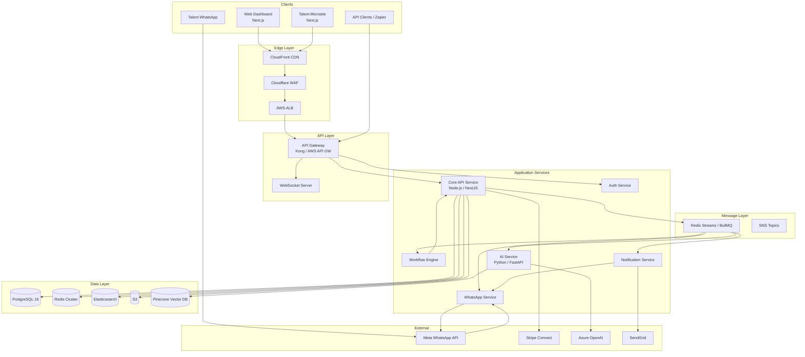
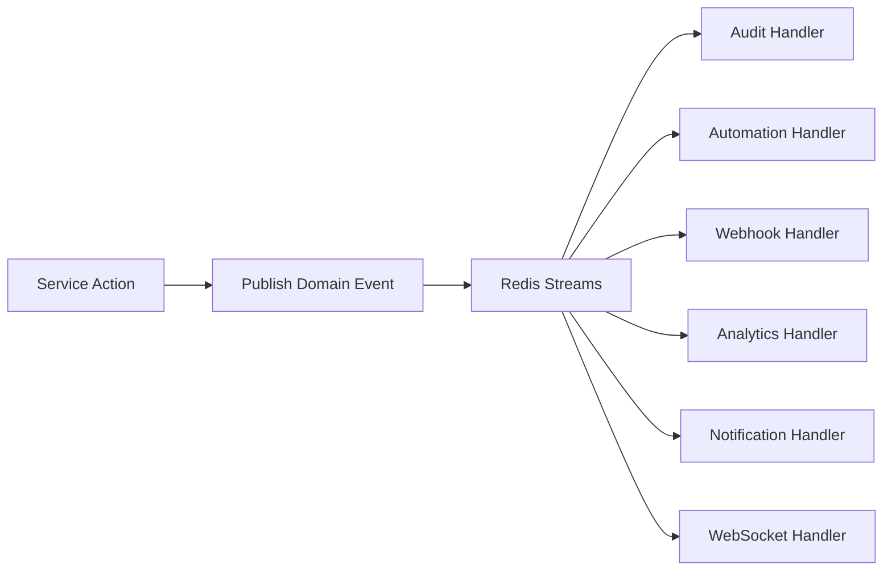
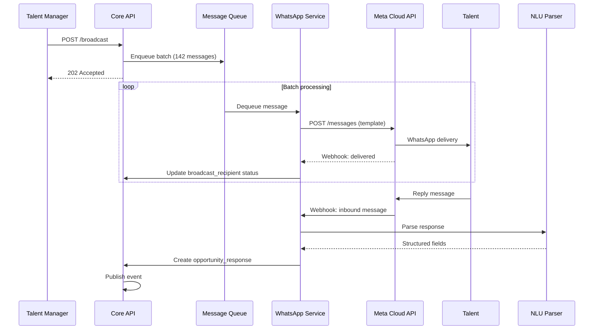
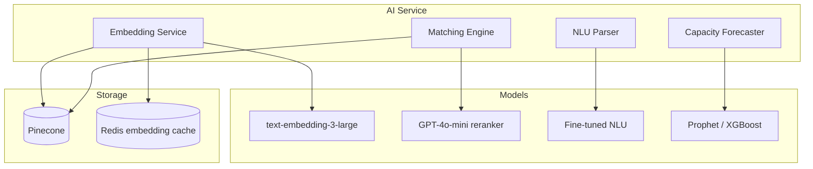
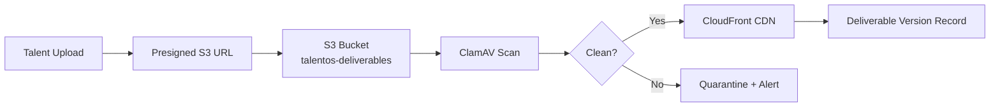

# Appendix F: TalentOS Technical Architecture

| Field | Value |
|-------|-------|
| **Version** | 1.0.0 |
| **Pattern** | Modular Monolith → Microservices |
| **Last Updated** | 2026-07-01 |

---

## 1. Architecture Overview

TalentOS follows a **modular monolith** architecture for Phase 1 (MVP), designed for extraction into microservices as scale demands. The system is event-driven for async operations (broadcasts, automations, AI inference, payments).



---

## 2. Technology Stack

### 2.1 Frontend

| Component | Technology | Rationale |
|-----------|-----------|-----------|
| Web Dashboard | Next.js 14 (App Router) | SSR, React ecosystem, Vercel/AWS deploy |
| UI Framework | Tailwind CSS + shadcn/ui | Rapid development, consistent design |
| State Management | TanStack Query + Zustand | Server state + minimal client state |
| Real-time | Socket.io client | Live notifications, broadcast progress |
| Talent Microsite | Next.js (static + SSR) | Lightweight, mobile-first |
| Charts | Recharts | Dashboard analytics |

### 2.2 Backend

| Component | Technology | Rationale |
|-----------|-----------|-----------|
| Core API | Node.js 20 + NestJS | TypeScript end-to-end; modular architecture |
| Auth Service | NestJS (shared module) | JWT, MFA, SSO |
| AI Service | Python 3.12 + FastAPI | ML ecosystem, embedding libraries |
| Workflow Engine | Temporal.io | Durable workflows, retry, saga patterns |
| WhatsApp Service | Node.js + BullMQ | Message queue processing |
| ORM | Prisma | Type-safe queries, migrations |
| Validation | Zod | Runtime schema validation |
| API Docs | Swagger / OpenAPI 3.1 | Auto-generated from decorators |

### 2.3 Data & Infrastructure

| Component | Technology | Rationale |
|-----------|-----------|-----------|
| Primary DB | PostgreSQL 16 (RDS) | ACID, JSONB, partitioning, RLS |
| Cache | Redis 7 (ElastiCache) | Sessions, rate limits, pub/sub |
| Search | Elasticsearch 8 | Full-text talent search |
| Vector DB | Pinecone | Embedding similarity search |
| Object Storage | AWS S3 | Deliverables, exports, archives |
| CDN | CloudFront | Static assets, presigned URLs |
| Container Orchestration | AWS EKS | Kubernetes, auto-scaling |
| IaC | Terraform | Reproducible infrastructure |
| CI/CD | GitHub Actions | Build, test, deploy pipeline |

---

## 3. Service Decomposition

### 3.1 Core API Service (Modular Monolith)

```
src/
├── modules/
│   ├── workspace/
│   ├── talent/
│   ├── opportunity/
│   ├── project/
│   ├── deliverable/
│   ├── payment/
│   ├── communication/
│   ├── analytics/
│   ├── automation/
│   └── audit/
├── common/
│   ├── auth/
│   ├── database/
│   ├── events/
│   └── permissions/
└── main.ts
```

Each module contains:
- `controller.ts` — HTTP endpoints
- `service.ts` — Business logic
- `repository.ts` — Data access
- `dto.ts` — Request/response schemas
- `events.ts` — Domain events
- `permissions.ts` — Module-specific auth

### 3.2 Service Boundaries (Future Extraction)

| Service | Responsibilities | Extraction Trigger |
|---------|-----------------|-------------------|
| Core API | CRUD, business rules | N/A (base) |
| Auth Service | Identity, SSO, MFA | > 50K MAU |
| WhatsApp Service | Message send/receive, parsing | > 1M msgs/day |
| AI Service | Embeddings, matching, NLU | GPU requirements |
| Workflow Engine | Automations, approvals | Complex workflow demand |
| Analytics Service | Reporting, aggregations | Query load on primary DB |

---

## 4. Event-Driven Architecture

### 4.1 Domain Events

```typescript
interface DomainEvent {
  id: string;
  type: string;           // e.g., 'deliverable.approved'
  workspace_id: string;
  entity_type: string;
  entity_id: string;
  payload: Record<string, unknown>;
  occurred_at: string;
  correlation_id: string;
}
```

### 4.2 Event Flow



### 4.3 Event Catalog

| Event | Publishers | Consumers |
|-------|-----------|-----------|
| `talent.created` | Talent module | Audit, AI (embedding), Analytics |
| `opportunity.response.received` | Opportunity module | Audit, Automation, AI, WebSocket |
| `broadcast.completed` | WhatsApp service | Audit, Analytics, WebSocket |
| `deliverable.submitted` | Deliverable module | Audit, Automation, Notification, WebSocket |
| `deliverable.approved` | Deliverable module | Payment, Audit, Automation, WebSocket |
| `payment.completed` | Payment module | Audit, Notification, Analytics, Webhook |

---

## 5. WhatsApp Integration Architecture



### 5.1 Message Types

| Type | Direction | Use Case |
|------|-----------|----------|
| Template | Outbound | Opportunity broadcast, status notifications |
| Session | Outbound | Replies within 24h window |
| Interactive | Both | Structured response buttons/lists |
| Media | Inbound | Deliverable file submission |

### 5.2 Template Management

- Templates registered in Meta Business Manager
- Template mapping stored in workspace settings
- Variable substitution: `{{1}}` = talent name, `{{2}}` = opportunity title
- Template versioning with fallback

---

## 6. AI Service Architecture



### 6.1 Matching Pipeline

1. **Embed** opportunity requirements (skills, description, constraints)
2. **Retrieve** top-50 candidates from Pinecone (cosine similarity)
3. **Filter** by availability, status, consent
4. **Rerank** using cross-encoder model with features: performance score, rate fit, response history
5. **Explain** top-3 factors per match
6. **Return** ranked list with confidence scores

### 6.2 Embedding Strategy

| Entity | Embedding Source | Refresh Trigger |
|--------|-----------------|-----------------|
| Talent profile | skills + bio + work history | Profile update |
| Opportunity | requirements + description | On create |
| Past projects | deliverable metadata + ratings | On completion |

---

## 7. Workflow Engine (Temporal)

### 7.1 Workflow Types

| Workflow | Steps | Duration |
|----------|-------|----------|
| `BroadcastWorkflow` | Validate → Batch → Send → Track → Complete | Minutes |
| `ApprovalWorkflow` | Notify → Wait signal → Chain → Complete | Days |
| `PaymentWorkflow` | Eligible → Approve → Process → Confirm | Days |
| `AutomationWorkflow` | Trigger → Condition → Actions → Log | Seconds |
| `OnboardingWorkflow` | Invite → Consent → Profile → Activate | Days |

### 7.2 Approval Workflow Example

```typescript
async function approvalWorkflow(deliverableId: string, chain: ApprovalStep[]) {
  for (const step of chain) {
    await notifyApprover(step.approver_id, deliverableId);
    
    const decision = await condition(
      () => getApprovalDecision(deliverableId, step.number),
      { timeout: step.timeout_hours * 3600 * 1000 }
    );
    
    if (decision.status === 'rejected') {
      await updateDeliverableStatus(deliverableId, 'rejected');
      return;
    }
    if (decision.status === 'expired') {
      await escalateApproval(step, deliverableId);
    }
  }
  
  await updateDeliverableStatus(deliverableId, 'approved');
  await createPaymentRecord(deliverableId);
}
```

---

## 8. Data Flow Patterns

### 8.1 CQRS (Read/Write Separation)

| Pattern | Implementation |
|---------|---------------|
| Writes | Core API → PostgreSQL (normalized) |
| Reads (lists) | Core API → PostgreSQL with optimized indexes |
| Reads (search) | Core API → Elasticsearch |
| Reads (analytics) | Analytics service → Materialized views / read replicas |
| Reads (AI) | AI service → Pinecone + PostgreSQL |

### 8.2 Materialized Views (Analytics)

```sql
CREATE MATERIALIZED VIEW mv_talent_performance AS
SELECT
    workspace_id,
    talent_id,
    COUNT(*) AS total_deliverables,
    AVG(composite_score) AS avg_score,
    AVG(CASE WHEN timeliness_score >= 80 THEN 1 ELSE 0 END) AS on_time_rate,
    AVG(revision_count) AS avg_revisions
FROM performance_records pr
JOIN deliverables d ON d.id = pr.deliverable_id
GROUP BY workspace_id, talent_id;

-- Refresh: every 15 minutes via cron job
```

---

## 9. Caching Strategy

| Cache | Key Pattern | TTL | Invalidation |
|-------|------------|-----|--------------|
| User permissions | `perm:{ws}:{user}` | 5 min | Role change |
| Talent profile | `talent:{ws}:{id}` | 10 min | Profile update |
| Segment members | `seg:{ws}:{id}` | 15 min | Segment change |
| Search results | `search:{ws}:{hash}` | 5 min | Talent update |
| AI embeddings | `emb:{ws}:{id}` | 24 hours | Profile update |
| Dashboard metrics | `dash:{ws}:{type}` | 5 min | Event-driven |

---

## 10. File Storage Architecture



**Bucket structure:**
```
s3://talentos-deliverables/
  {workspace_id}/
    {project_id}/
      {deliverable_id}/
        v1/{filename}
        v2/{filename}
```

**Lifecycle policies:**
- Standard → Infrequent Access after 90 days
- Infrequent Access → Glacier after 365 days
- Delete quarantined after 7 days

---

## 11. Search Architecture

### 11.1 Elasticsearch Indices

| Index | Source | Fields |
|-------|--------|--------|
| `talents` | talents + talent_skills | name, skills, bio, location, rates, score |
| `opportunities` | opportunities | title, description, requirements, status |
| `projects` | projects | name, description, status, talent names |
| `communications` | communications | content, talent name, project name |

### 11.2 Index Sync

- **CDC** via PostgreSQL logical replication → Elasticsearch
- **Lag target:** < 5 seconds
- **Full reindex:** Weekly off-peak

---

## 12. API Gateway Configuration

```yaml
routes:
  - path: /v1/auth/*
    service: auth-service
    rate_limit: 20/min
  
  - path: /v1/webhooks/*
    service: webhook-receiver
    rate_limit: 1000/min
    ip_allowlist: [meta_ips, stripe_ips]
  
  - path: /v1/*
    service: core-api
    rate_limit: ${plan_rate_limit}
    auth: jwt
  
  - path: /v1/ws
    service: websocket-server
    auth: jwt

plugins:
  - cors
  - rate-limiting
  - request-transformer (add X-Request-ID)
  - response-transformer (add security headers)
  - prometheus (metrics)
```

---

## 13. Error Handling & Resilience

| Pattern | Implementation |
|---------|---------------|
| Circuit breaker | WhatsApp API, OpenAI, Stripe (via opossum) |
| Retry | Exponential backoff; max 3 retries for transient errors |
| Dead letter queue | Failed messages after max retries → DLQ → alert |
| Graceful degradation | AI unavailable → fallback to rule-based matching |
| Health checks | `/health` (liveness), `/ready` (readiness) per service |
| Bulkhead | Separate thread pools for WhatsApp, AI, core API |

---

## 14. Development & Testing

| Environment | Purpose | Data |
|-------------|---------|------|
| Local | Developer machines | Docker Compose; seed data |
| CI | Automated tests | Ephemeral PostgreSQL |
| Staging | Pre-production | Anonymized production copy |
| Sandbox | API consumer testing | Synthetic data; mock WhatsApp |
| Production | Live | Real data |

**Test pyramid:**
- Unit tests: 80% coverage target
- Integration tests: API endpoints with test DB
- E2E tests: Playwright for critical flows
- Load tests: k6 for broadcast and API throughput
