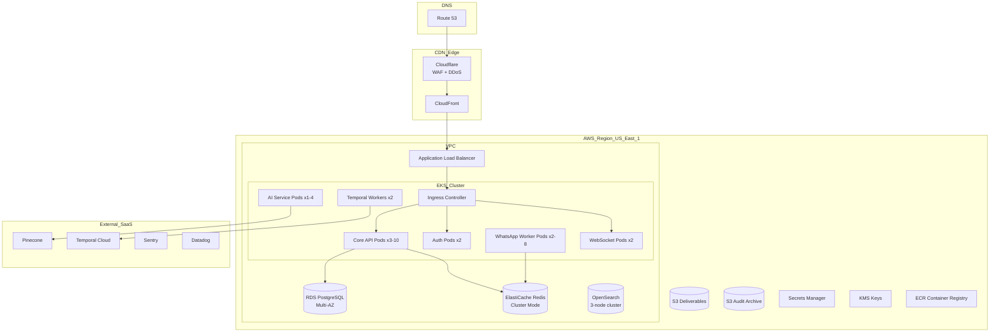
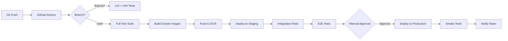

# Appendix G: TalentOS Deployment & Infrastructure Architecture

| Field | Value |
|-------|-------|
| **Version** | 1.0.0 |
| **Cloud Provider** | AWS (primary) |
| **IaC** | Terraform |
| **Last Updated** | 2026-07-01 |

---

## 1. Deployment Architecture Overview



---

## 2. Environment Strategy

| Environment | AWS Account | Region | Purpose |
|-------------|-------------|--------|---------|
| Development | dev-account | us-east-1 | Developer testing |
| Staging | staging-account | us-east-1 | Pre-production validation |
| Production | prod-account | us-east-1 | Live traffic |
| Production EU | prod-account | eu-central-1 | Enterprise data residency |
| DR | prod-account | us-west-2 | Disaster recovery standby |

**Account isolation:** Separate AWS accounts per environment via AWS Organizations.

---

## 3. Kubernetes (EKS) Configuration

### 3.1 Cluster Specification

| Setting | Staging | Production |
|---------|---------|------------|
| Kubernetes version | 1.29 | 1.29 |
| Node type | m6i.large | m6i.xlarge |
| Min nodes | 2 | 3 |
| Max nodes | 5 | 20 |
| Node pools | general, workers | general, workers, ai |
| Spot instances | Yes (workers) | Yes (workers, 30%) |

### 3.2 Namespace Layout

```
talentos-production/
├── ingress/          # NGINX ingress controller
├── core/             # Core API service
├── auth/             # Auth service
├── whatsapp/         # WhatsApp workers
├── ai/               # AI service (GPU optional)
├── workflow/         # Temporal workers
├── websocket/        # WebSocket server
├── monitoring/       # Prometheus, Grafana agents
└── jobs/             # CronJobs (reports, cleanup, archival)
```

### 3.3 Deployment Manifest (Core API)

```yaml
apiVersion: apps/v1
kind: Deployment
metadata:
  name: core-api
  namespace: talentos-production
spec:
  replicas: 3
  strategy:
    type: RollingUpdate
    rollingUpdate:
      maxSurge: 1
      maxUnavailable: 0
  selector:
    matchLabels:
      app: core-api
  template:
    spec:
      containers:
        - name: core-api
          image: ${ECR_REGISTRY}/talentos-core:${VERSION}
          ports:
            - containerPort: 8080
          resources:
            requests:
              cpu: 500m
              memory: 512Mi
            limits:
              cpu: 2000m
              memory: 2Gi
          env:
            - name: DATABASE_URL
              valueFrom:
                secretKeyRef:
                  name: talentos-secrets
                  key: database-url
          livenessProbe:
            httpGet:
              path: /health
              port: 8080
            initialDelaySeconds: 15
            periodSeconds: 10
          readinessProbe:
            httpGet:
              path: /ready
              port: 8080
            initialDelaySeconds: 5
            periodSeconds: 5
      affinity:
        podAntiAffinity:
          requiredDuringSchedulingIgnoredDuringExecution:
            - labelSelector:
                matchLabels:
                  app: core-api
              topologyKey: kubernetes.io/hostname
```

### 3.4 Horizontal Pod Autoscaler

```yaml
apiVersion: autoscaling/v2
kind: HorizontalPodAutoscaler
metadata:
  name: core-api-hpa
spec:
  scaleTargetRef:
    apiVersion: apps/v1
    kind: Deployment
    name: core-api
  minReplicas: 3
  maxReplicas: 10
  metrics:
    - type: Resource
      resource:
        name: cpu
        target:
          type: Utilization
          averageUtilization: 60
    - type: Pods
      pods:
        metric:
          name: http_requests_per_second
        target:
          type: AverageValue
          averageValue: 100
```

---

## 4. Database Infrastructure

### 4.1 RDS PostgreSQL

| Setting | Staging | Production |
|---------|---------|------------|
| Instance class | db.r6g.large | db.r6g.xlarge |
| Storage | 100 GB gp3 | 500 GB gp3 (auto-scaling to 2TB) |
| Multi-AZ | No | Yes |
| Read replicas | 0 | 2 (analytics, reporting) |
| Backup retention | 7 days | 35 days |
| Encryption | KMS | KMS (dedicated CMK) |
| Parameter group | Custom (pg16 optimizations) | Custom |
| Connection pooling | PgBouncer sidecar | PgBouncer (dedicated, 2 instances) |

### 4.2 PgBouncer Configuration

```ini
[databases]
talentos = host=rds-endpoint port=5432 dbname=talentos

[pgbouncer]
pool_mode = transaction
max_client_conn = 1000
default_pool_size = 25
min_pool_size = 5
reserve_pool_size = 5
server_lifetime = 3600
```

### 4.3 Database Maintenance

| Task | Schedule | Method |
|------|----------|--------|
| Vacuum/analyze | Daily 03:00 UTC | pg_cron |
| Partition creation | Monthly (automated) | pg_partman |
| Index rebuild | Quarterly | CONCURRENTLY |
| Statistics update | Hourly | ANALYZE on hot tables |
| Backup verification | Weekly | Restore to staging |

---

## 5. Redis Infrastructure

### 5.1 ElastiCache Cluster

| Setting | Staging | Production |
|---------|---------|------------|
| Node type | cache.r6g.large | cache.r6g.xlarge |
| Cluster mode | Enabled | Enabled |
| Shards | 1 | 3 |
| Replicas per shard | 1 | 2 |
| Encryption | In-transit + at-rest | In-transit + at-rest |
| Eviction policy | allkeys-lru | allkeys-lru |

### 5.2 Redis Usage Allocation

| DB Index | Purpose |
|----------|---------|
| 0 | Session cache |
| 1 | Permission cache |
| 2 | Rate limiting |
| 3 | BullMQ job queues |
| 4 | Pub/sub (WebSocket) |
| 5 | General application cache |

---

## 6. Object Storage (S3)

### 6.1 Bucket Configuration

| Bucket | Purpose | Lifecycle |
|--------|---------|-----------|
| `talentos-deliverables-prod` | Deliverable files | IA@90d, Glacier@365d |
| `talentos-audit-archive-prod` | Audit log archives | Glacier@365d |
| `talentos-exports-prod` | Report exports | Delete@30d |
| `talentos-backups-prod` | DB backups | Delete@35d |
| `talentos-assets-prod` | Static assets | CDN cached |

### 6.2 S3 Security

```json
{
  "Version": "2012-10-17",
  "Statement": [
    {
      "Effect": "Deny",
      "Principal": "*",
      "Action": "s3:*",
      "Resource": "arn:aws:s3:::talentos-deliverables-prod/*",
      "Condition": {
        "Bool": { "aws:SecureTransport": "false" }
      }
    }
  ]
}
```

- Block all public access
- SSE-KMS encryption (dedicated CMK per bucket)
- VPC endpoint for private access
- Access logging to dedicated logging bucket

---

## 7. CI/CD Pipeline



### 7.1 Pipeline Stages

| Stage | Tools | Duration | Gate |
|-------|-------|----------|------|
| Lint & Format | ESLint, Prettier, Ruff | 2 min | Must pass |
| Unit Tests | Jest, pytest | 5 min | 80% coverage |
| SAST | CodeQL, Snyk | 3 min | No critical/high |
| Build | Docker multi-stage | 5 min | Image scan (Trivy) |
| Integration | Testcontainers | 10 min | Must pass |
| Deploy Staging | ArgoCD | 3 min | Auto |
| E2E | Playwright | 15 min | Must pass |
| Deploy Production | ArgoCD | 3 min | Manual approval |
| Smoke | curl + health checks | 2 min | Must pass |

### 7.2 Deployment Strategy

- **Rolling update** for stateless services (default)
- **Blue-green** for database migrations with schema changes
- **Canary** (10% → 50% → 100%) for high-risk changes
- **Feature flags** for all new features (LaunchDarkly / custom)

### 7.3 Rollback

```bash
# Automatic rollback triggers:
# - Smoke test failure
# - Error rate > 5% for 5 minutes
# - p95 latency > 2x baseline for 10 minutes

# Manual rollback:
argocd app rollback talentos-core --revision ${PREVIOUS_REVISION}
```

---

## 8. Networking

### 8.1 VPC Design

```
VPC: 10.0.0.0/16 (us-east-1)

Public Subnets (10.0.1.0/24, 10.0.2.0/24):
  - ALB
  - NAT Gateway (one per AZ)

Private App Subnets (10.0.10.0/24, 10.0.11.0/24):
  - EKS worker nodes
  - PgBouncer

Private Data Subnets (10.0.20.0/24, 10.0.21.0/24):
  - RDS
  - ElastiCache
  - OpenSearch

VPC Endpoints:
  - s3 (gateway)
  - ecr.api, ecr.dkr (interface)
  - secretsmanager (interface)
  - kms (interface)
  - logs (interface)
```

### 8.2 DNS

| Record | Type | Target |
|--------|------|--------|
| `app.talentos.io` | CNAME | CloudFront distribution |
| `api.talentos.io` | CNAME | CloudFront → ALB |
| `auth.talentos.io` | CNAME | CloudFront → ALB |
| `sandbox.api.talentos.io` | CNAME | Staging ALB |
| `status.talentos.io` | CNAME | Status page provider |

---

## 9. Disaster Recovery

### 9.1 DR Strategy

| Component | RPO | RTO | Strategy |
|-----------|-----|-----|----------|
| PostgreSQL | 1 hour | 4 hours | Cross-region read replica (us-west-2); manual failover |
| Redis | 15 min | 1 hour | Cross-region replication |
| S3 | 0 | 1 hour | Cross-region replication (CRR) |
| Application | N/A | 2 hours | Terraform + ArgoCD deploy to DR region |
| DNS | N/A | 15 min | Route 53 health checks + failover |

### 9.2 DR Runbook (Summary)

1. **Detect:** Monitoring alerts on primary region failure
2. **Assess:** Confirm region-wide outage (not single service)
3. **Decide:** Activate DR (requires VP Engineering approval)
4. **Database:** Promote us-west-2 read replica to primary
5. **Application:** Deploy EKS cluster in us-west-2 via Terraform
6. **DNS:** Route 53 failover to us-west-2 ALB
7. **Verify:** Run smoke tests; monitor error rates
8. **Communicate:** Status page update; customer notification
9. **Recovery:** Failback when primary region restored

### 9.3 DR Testing

- **Tabletop exercise:** Quarterly
- **Full DR failover test:** Semi-annual (staging)
- **Backup restore test:** Monthly

---

## 10. Monitoring & Observability Infrastructure

### 10.1 Stack Deployment

| Component | Deployment | Retention |
|-----------|-----------|-----------|
| Prometheus | EKS (monitoring namespace) | 30 days |
| Grafana | EKS (monitoring namespace) | Dashboards |
| Loki | EKS or Grafana Cloud | 30 days logs |
| Tempo | Grafana Cloud | 7 days traces |
| Sentry | SaaS | 90 days errors |
| Datadog | SaaS (APM + RUM) | 15 months metrics |
| PagerDuty | SaaS | On-call routing |

### 10.2 Log Aggregation

```yaml
# Fluent Bit → Loki pipeline
pipeline:
  inputs:
    - name: tail
      path: /var/log/containers/*.log
      parser: docker
  filters:
    - name: kubernetes
      labels: [app, namespace, pod]
    - name: modify
      add:
        - environment production
  outputs:
    - name: loki
      url: http://loki.monitoring:3100
      labels:
        - job=talentos
        - app=${APP}
```

### 10.3 Alerting Routing

| Severity | Channel | Response |
|----------|---------|----------|
| P0 | PagerDuty → Phone | 15 min |
| P1 | PagerDuty → Slack | 30 min |
| P2 | Slack #alerts | 4 hours |
| P3 | Slack #monitoring | Next business day |

---

## 11. Cost Optimization

### 11.1 Estimated Monthly Cost (Production — Year 1)

| Service | Specification | Est. Cost |
|---------|--------------|-----------|
| EKS cluster | 3-10 nodes m6i.xlarge | $1,500–$5,000 |
| RDS PostgreSQL | db.r6g.xlarge Multi-AZ + 2 replicas | $1,200 |
| ElastiCache | 3 shards r6g.xlarge | $800 |
| S3 | 5 TB storage + requests | $150 |
| OpenSearch | 3x r6g.large | $600 |
| CloudFront | 2 TB transfer | $200 |
| NAT Gateway | 2 AZ | $100 |
| Secrets/KMS | — | $50 |
| Pinecone | Starter pod | $70 |
| Temporal Cloud | — | $200 |
| Datadog | 15 hosts | $500 |
| **Total** | | **~$5,400–$8,900** |

### 11.2 Cost Optimization Strategies

| Strategy | Savings |
|----------|---------|
| Spot instances for worker pods | 30–60% on compute |
| Reserved instances (RDS, ElastiCache) | 30–40% |
| S3 lifecycle policies | 50%+ on old deliverables |
| Right-sizing (quarterly review) | 10–20% |
| PgBouncer connection pooling | Smaller RDS instance |

---

## 12. Infrastructure as Code (Terraform)

### 12.1 Module Structure

```
terraform/
├── modules/
│   ├── vpc/
│   ├── eks/
│   ├── rds/
│   ├── elasticache/
│   ├── s3/
│   ├── kms/
│   ├── alb/
│   └── monitoring/
├── environments/
│   ├── dev/
│   │   ├── main.tf
│   │   ├── variables.tf
│   │   └── terraform.tfvars
│   ├── staging/
│   └── production/
└── global/
    ├── route53/
    ├── ecr/
    └── iam/
```

### 12.2 State Management

- **Backend:** S3 + DynamoDB locking
- **State per environment:** Separate state files
- **Drift detection:** Weekly Terraform plan in CI
- **Policy:** All infrastructure changes via Terraform PR

---

## 13. Secrets & Configuration Management

| Secret | Storage | Rotation | Access |
|--------|---------|----------|--------|
| Database credentials | Secrets Manager | 90 days auto | Core API, workers |
| JWT signing keys | KMS | Annual | Auth service |
| WhatsApp API tokens | Secrets Manager | On Meta rotation | WhatsApp service |
| Stripe API keys | Secrets Manager | 90 days | Payment module |
| OpenAI API keys | Secrets Manager | Manual | AI service |
| Webhook HMAC secrets | Secrets Manager | Customer-initiated | Webhook service |

**Configuration (non-secret):**
- Environment variables via Kubernetes ConfigMaps
- Feature flags via LaunchDarkly
- Plan limits via database (cached in Redis)

---

## 14. Compliance Infrastructure

| Requirement | Implementation |
|-------------|---------------|
| SOC 2 | Datadog audit trail, AWS Config, CloudTrail |
| GDPR | EU region deployment; data export/erasure jobs |
| Encryption | KMS CMK for all data stores |
| Access logging | CloudTrail + application audit logs |
| Vulnerability scanning | AWS Inspector + Snyk container |
| Network isolation | VPC, security groups, NACLs |

---

## 15. Scaling Playbook

### 15.1 Scale Triggers

| Metric | Threshold | Action |
|--------|-----------|--------|
| API CPU | > 60% for 5 min | HPA scale up |
| API p95 latency | > 500ms for 10 min | Scale up + investigate |
| WhatsApp queue depth | > 5,000 | Scale WA workers |
| DB connections | > 80% pool | Scale PgBouncer; add read replica |
| DB CPU | > 70% sustained | Upgrade instance class |
| Redis memory | > 75% | Add shard |
| Storage | > 70% capacity | Increase allocation |

### 15.2 Growth Milestones

| Milestone | Infrastructure Change |
|-----------|----------------------|
| 500 workspaces | Add RDS read replica |
| 1,000 workspaces | Elasticsearch cluster scale |
| 2,500 workspaces | Redis add shard |
| 5,000 workspaces | Extract WhatsApp to dedicated service |
| 10,000 workspaces | Multi-region active-active |
| 1M msgs/day | Dedicated WhatsApp worker pool (20+ pods) |
