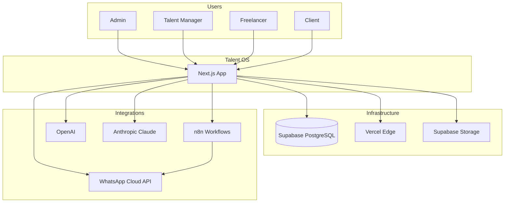
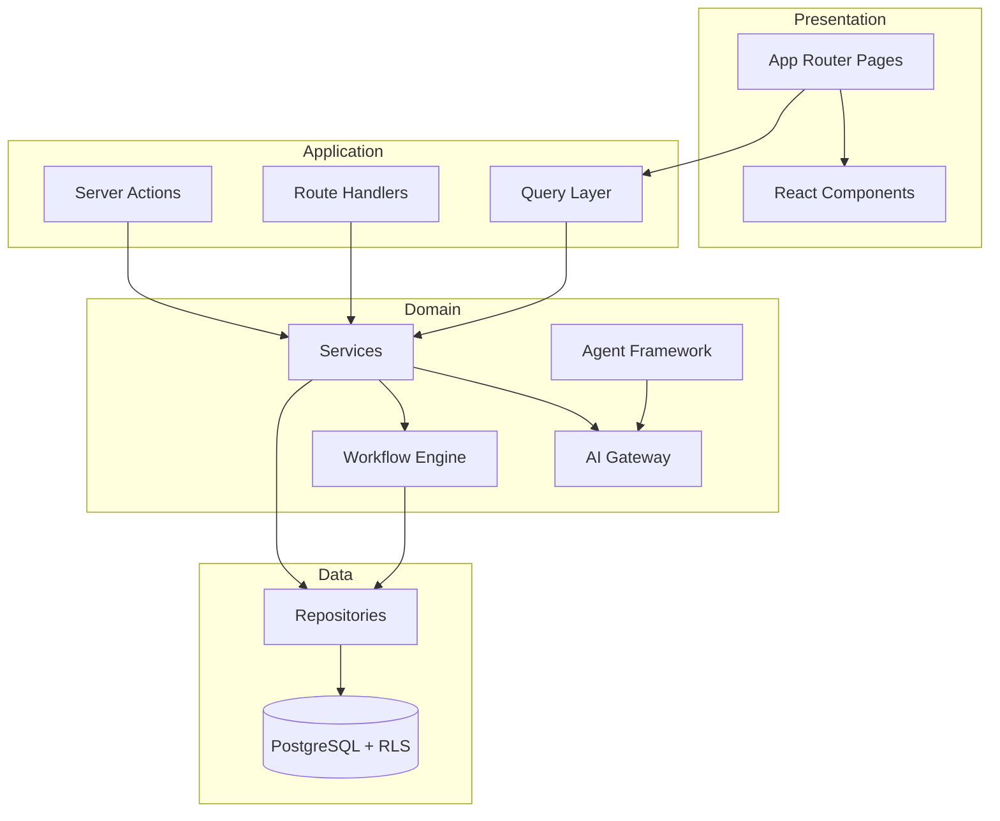
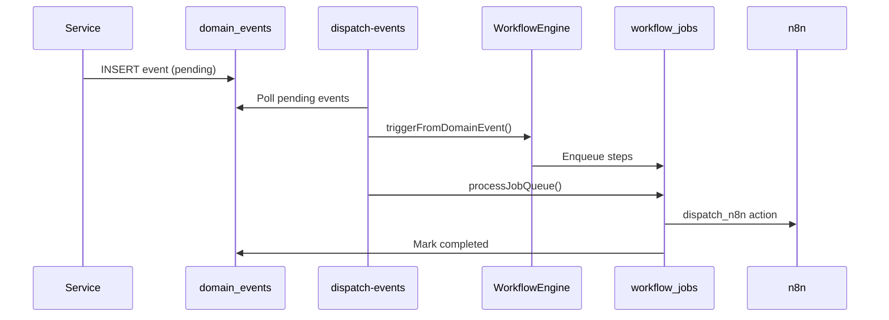
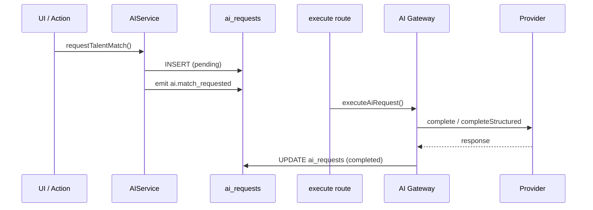
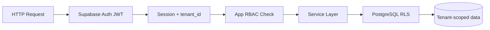
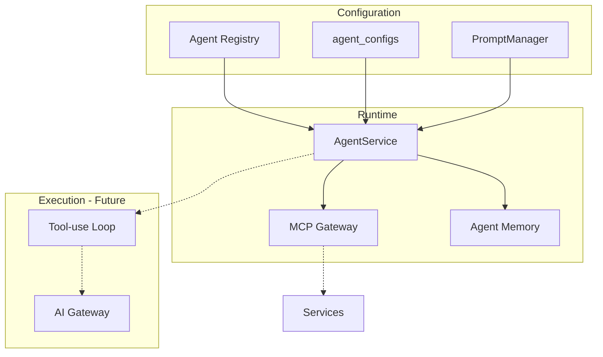
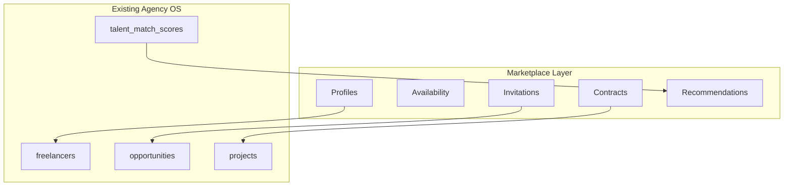

# System Diagrams

Architecture diagrams for Talent OS. Rendered as Mermaid in GitHub and compatible viewers.

---

## System Context (C4 Level 1)

---

## Application Layers

---

## Event-Driven Flow

---

## AI Request Flow

---

## Multi-Tenant Isolation

---

## Agent Framework

---

## Marketplace Layer (Planned)

See [35-marketplace-architecture.md](./35-marketplace-architecture.md)

---

## Related

- [Architecture](./architecture.md)
- [11 Enterprise Architecture](./11-enterprise-system-architecture.md) — additional C4 diagrams
- [Events](./events.md)
- [Workflow](./workflow.md)
